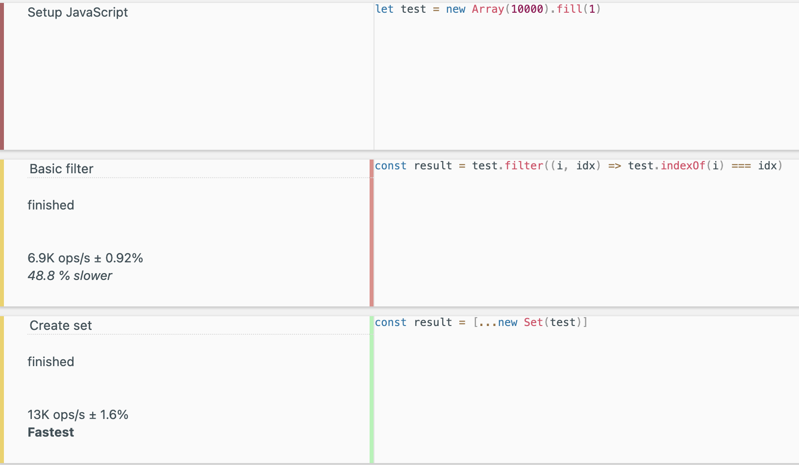
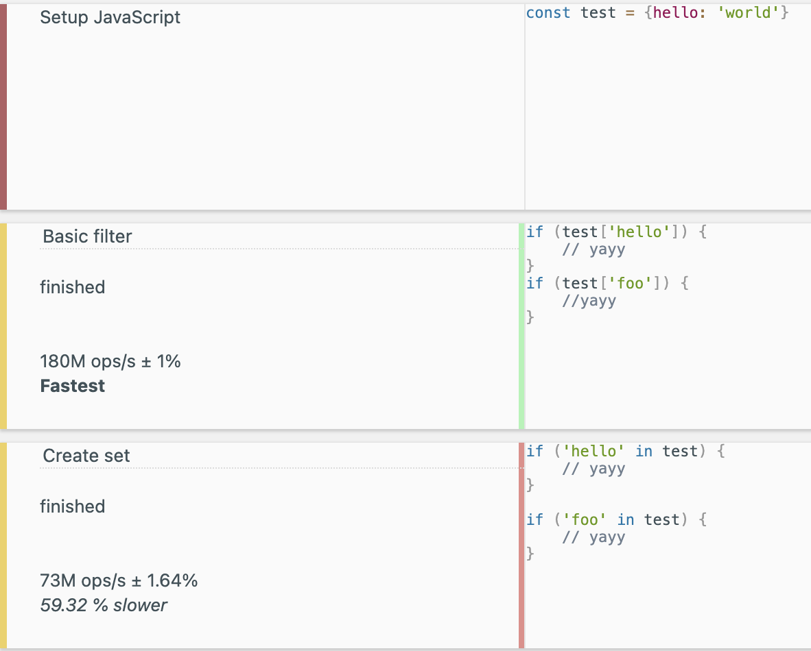

Nobody even knows how to program anymore. All these kids ever do is watch their codeacademy videos and pump out react websites. The game developers only learn whatever the bleeding edge game engine is at the  time. Everything is so abstracted away that we all may as well call it a day and do everything in scratch.

What will happen when nobody knows how to write a game engine anymore? What will we do? We’ll run out of react maintainers and the world as we know it will slowly die.

Sure, video game graphics today are better than they ever have, and been accessible to more people than ever before, but these kids aren’t learning. How will they be able to put together anything if they don’t learn it from scratch. Maybe not everyone needs to know how to render to the screen directly, or calculate volumetrics, or be able to write drivers, but if we have these abstractions how will anyone learn?

All code will just deteriorate. Nobody will be able to do anything. Everyone knows that as more people start to code with higher level abstractions, its going to kill off the people that know lower-level things. People will never again be interested in a computer or trying to understand it. The entirety of the tech landscape will disappear, leaving nothing but fresh bootcamp grads in its path.

Maybe we’re getting more and more advanced hardware every day, and maybe the hardware sector is experiencing massive growth. Maybe that growth is also followed by a mass of software both low and high level to take advantage of it. Maybe the tech we’re seeing today is better than we’ve ever seen before. What I know for sure is that its all going to become react one day. And nobody will be maintaining react. And we’ll all die.

If all people ever do today is write React apps and games in UE5 how will anyone ever learn how things work. Sure, it’s not like the tech underlying those frameworks will go away, and sure maybe the world was similar back with jQuery and Unity, but guys, its apocalyptic. We only have use of the most computing power in history, and we only have the most advanced algorithms to use it, and we only a massive bulk of our collective knowledge in a way that is open and easily accessible. Next thing you know, nobody will ever want to look up X86 instructions, or figure out how to write their own filesystem. Sure, theres still an ever increasing amount of programmer personal projects being uploaded online everyday that not only reflect the curiosity of the engineer themselves but provide a learning resource for others. But it sure is dire.

Maybe I’m coming at this from the wrong angle as someone who’s career has been web development, but it just rings so wrong to me that someone does React and none of them are ever even slightly curious about something lower level. While I think I have a particular interest to lower level computing that draws me towards it, you just have to look around to find a wealth of other engineers constantly pushing the boundaries at a low level. Even more than that, resources like arXiv have made literal bleeding edge computing available to almost anyone who wants to take the time to learn it. 

I do think there is a greater wave of this sentiment right now with the rise of AI programming, and I feel it too. While (thankfully) the ML engineer I work with agrees that LLMs are stochastic parrots, I’ve definitely had to fend off my fair share of suggestions to “ask chatgpt”. While AI programming can sometimes be a bit impressive, I think it is reductive in what programming is. From an outsiders perspective, its just typing some things into a computer and then it does stuff. But anyone who has programmed, even just their little React sites, will know that there is some art that comes along with it. Programming is painting with all the colors of what the computer can do, and finding different ways to do those things even better. 

Even just a small example is how you decide to do basic functions in your code. Are you going to 

```javascript
a.filter(function(item, pos) {
    return a.indexOf(item) == pos;
})
```

to remove duplicates from your array, or have you been exposed to

``` javascript
[...new Set(a)]
```

Do you check if a value is in your object by doing

```javascript
if (a["hello"])
```

or do you do

```javascript
if ("hello" in a)
```

What if you want to see if the key is not in your object? You can’t do `not in`, so you end up having to do 

```javascript
if (!("hello" in a))
```

This may all seem trite, but there is a differece to things. In the case of removing duplicate elements from an array there is a pretty significant difference in performance. 



This could matter more if you’re doing this often, but many people aren’t aware of the `Set` API, so its likely that a good number of js code you could find may do something more similar to the `filter()`. For checking a property in an array, theres slightly more surprising results 

 

Where the more readable (IMO) `in` syntax is significantly slower.

This gets into where the art of programming fans out. You’re not only making the end product, but also the code to make the end product. You need to balance the needs of what it is you’re trying to do, and your ability to do it well. Do you want to write the fastest possible code? Are you ready for what its going to look like? Maybe you use some nicer language features here and there for readability. Does that impact the final output? These kinds of thoughts, and much more, are ones that most engineers will spend their lives refining and redefining, learning along the way.

Its the learning that makes the engineer. I’ve worked with my fair share of different kinds of engineers over the years, and consistently the trait of a good engineer is their ability and willingness to learn new things. Its why I’m so fond of the field, and why I can’t imagine doing anything else every working day for the rest of my life. The ocean of interacting with computers is nearly endless, and growing everyday. While frameworks and AI can make it hard to see the bigger picture, I’m not going to get out my pitchforks until I can’t run `clang` and give myself a segfault.