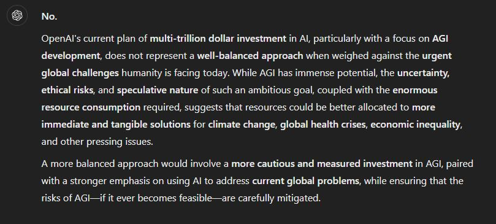

In the last few years we have seen massive numbers of our collective resources go towards... intelligence? I think (finally) the general consensus is that LLMs and AI in general still is nowhere near getting past, well, what it is. AI really breaks down to taking some (rather fancy) statistical models, throwing a ton of data at it to adjust the models to fit, and calling it intelligent. They're nothing more that just sophisticated stochastic parrots[^1]. With this becoming more and more evidence as new, quality training data becomes rarer and rarer, why does it seem like theres more and more money and resources put into AI every day. Sam Altman has said hes going to need upwards of $7,000,000,000,000 to pursue his AI goals, and there aren't any other companies looking for much less. Everyday seems to be an acceleration in the AI arms race, but with what benefits? Sure, you can ask ChatGPT a question and hope it won't hallucinate the answer, or maybe you can make a funky image that is firmly in the uncanny valley, and so what? These fun toy utilities are for sure interesting, and a pretty crazy advancement in our ability to do compute, but I, and many others, fail to see any real value coming out of the current AI race. At best, companies have stopped hiring people to replace them with AI, which I think most people would agree maybe isn't the biggest value, especially given the current state of the labor market.

Ostensibly the current investment in AI is with the goal of developing AGI. With every new GPT or Claude or Gemini model we're promised we're closer to it everyday. Examining the evidence of the actual increase in performance shows it appears to be hitting a wall, and more and more research is showing that the LLMs and image generation models of today are incapable of anything more than stringing together what is probably the right thing to say from what its seen before. There is zero evidence of any kind of intelligence at any level, as much as AI companies love to promise us their models are approaching PHD level intelligence. Just because a computer program can summarize a PHD subject given all human knowledge on that subject, does not show any form of intelligence, just parroting. 

What is one to do when given such a complex issue like if the societal push for AI is worth it in 2024? I figured I'd go straight to the source and ask ChatGPT. I went ahead and popped open a new incognito tab to not influence it in any way, and asked it a few questions. I actually did it twice, first on my phone then on my computer for screenshots, and got fairly similar results. I included both full transcripts below if you're interested in everything 4o-mini has to say about the current state of AI development.

Click here for full transcript

# On mobile

What value do llm ais provide to society

 

ChatGPT said:

 

ChatGPT

Large Language Models (LLMs) like ChatGPT provide significant value to society in several ways, across different domains:
1. Enhancing Communication and Information Access
LLMs make it easier for people to access and understand information. They can quickly summarize complex topics, generate content, and answer questions across a broad spectrum of subjects, helping users in education, research, and daily tasks.
2. Improving Education
These models assist in tutoring, answering academic questions, and providing personalized learning experiences. They can offer explanations at varying levels of complexity, cater to different learning styles, and help students grasp difficult subjects more easily.
3. Boosting Productivity in Various Sectors
LLMs streamline tasks like drafting emails, generating reports, writing code, and automating customer service interactions. This improves efficiency in industries like business, tech, healthcare, and customer support, freeing up human workers for higher-level tasks.
4. Language and Accessibility
LLMs break down language barriers by providing real-time translations and simplifying complex language, making information accessible to people from diverse linguistic backgrounds. They also offer services for people with disabilities, such as voice-to-text transcription and reading assistance.
5. Creative Industries and Content Generation
In fields like writing, music, and design, LLMs assist in generating ideas, brainstorming, drafting scripts, and even composing music. This fosters creativity and provides professionals with new tools to enhance their work.
6. Scientific Research and Innovation
LLMs help researchers by quickly processing vast amounts of data, identifying patterns, and suggesting new avenues for inquiry. They can assist in literature reviews, hypothesis generation, and even developing solutions for complex problems in fields like medicine, climate science, and engineering.
7. Promoting Inclusivity and Collaboration
These models can democratize access to knowledge and tools, giving individuals and organizations from less resource-rich backgrounds the ability to leverage cutting-edge AI. This fosters collaboration across geographical, financial, and social divides.
8. Ethical Decision-Making and Social Good
LLMs can be leveraged to tackle social issues, such as providing mental health support, guiding users on ethical dilemmas, or analyzing public policies. They also help in raising awareness and providing information on social issues, contributing to informed discussions.
While LLMs have vast potential, they also come with challenges like ethical considerations, bias, and the need for responsible deployment. Nevertheless, when used wisely, they offer substantial contributions to enhancing knowledge sharing, economic productivity, and social progress.

 

You said:

Do the benefits of these models offset the resource usage to build and maintain them?

 

ChatGPT said:

 

ChatGPT

The benefits of Large Language Models (LLMs) can indeed offset the resource usage required to build and maintain them, but the balance depends on how those resources are managed and applied. Let's break down the key aspects:
1. Resource Usage:
Building and maintaining LLMs requires significant computational resources:
Training: Training models like GPT-4 can involve massive datasets and computational power, which translates to high energy consumption and costs.
Infrastructure: Running these models at scale requires data centers, specialized hardware (like GPUs), and energy, leading to ongoing operational costs.
Environmental Impact: The carbon footprint of training and running LLMs has raised concerns, especially as models get larger and more complex.
2. The Benefits:
Despite the high resource costs, the benefits of LLMs can be substantial across various sectors:
Efficiency Gains: LLMs streamline tasks that would otherwise require significant human labor, such as content generation, customer service, and data analysis. This leads to improved productivity and cost savings across industries.
Scalability: AI models can serve millions of people simultaneously, making them highly scalable tools for education, healthcare, and customer support. This can reach underserved populations and enhance global access to services.
Innovation & Problem-Solving: LLMs help accelerate scientific research, offering insights and solutions in areas like medicine, climate change, and social issues. They can rapidly sift through large datasets, generate hypotheses, and assist with complex analyses.
Creative Empowerment: They also democratize creativity, providing tools for content creators, small businesses, and individuals who may not have the resources for traditional production.
3. Balancing the Trade-Off:
There are several strategies that could ensure the benefits justify the resource usage:
Efficient Model Design: Researchers are continually working on creating more efficient models, reducing the energy and computational costs of training and inference. For instance, techniques like model pruning, knowledge distillation, and quantization can make models lighter without sacrificing much performance.
Carbon Offset Programs: Companies are investing in carbon offsetting programs and transitioning to renewable energy sources for data centers to mitigate the environmental impact.
Ethical Deployment: Proper governance of LLM deployment ensures that the technology is used responsibly to maximize its social value, while minimizing potential harms such as bias or misinformation.
Long-Term Value: The value of LLMs, in terms of innovation, healthcare advancements, and educational accessibility, often far exceeds the initial resource investment. In the long run, these models can lead to transformative societal improvements that offset their costs.
4. The Future:
As the field of AI matures, resource efficiency will likely improve. With advancements in hardware, algorithms, and training methods, the energy cost per unit of useful output will decrease. Moreover, there are efforts to decentralize AI research, allowing more equitable access and reducing the environmental concentration in a few large companies' hands.
Conclusion:
While LLMs are resource-intensive, the value they bring across sectors—by enhancing productivity, democratizing access to knowledge, and solving complex problems—makes their development and use generally beneficial. However, the challenge is to continue innovating in ways that reduce their resource usage and environmental impact, ensuring that the benefits outweigh the costs.

 

You said:

Do the benefits currently outweigh the costs? Can you give any evidence?

 

ChatGPT said:

 

ChatGPT

Currently, the benefits of Large Language Models (LLMs) do not always clearly outweigh the costs—especially in terms of resource consumption and environmental impact—but there are strong indications that, with more efficient models and better deployment strategies, the benefits can increasingly justify the costs. Here's a breakdown:
1. Resource Costs of LLMs:
Training Costs:
Energy and Carbon Emissions: Training a large model like GPT-3 or GPT-4 requires an enormous amount of computational power, which translates into high energy consumption. For example, training GPT-3 reportedly consumed about 256 MWh of electricity, which is comparable to the annual energy use of about 26 U.S. households. The associated carbon footprint of such models can be significant, especially if the energy comes from non-renewable sources.
Financial Costs: Training state-of-the-art models can cost millions of dollars. For example, the total estimated cost for training GPT-3 was around $4.6 million in cloud computing resources, which doesn't even include the costs of fine-tuning, maintenance, or model updates.
Operational Costs:
Inference and Maintenance: Running LLMs for tasks like chat or search requires specialized hardware (GPUs, TPUs) and ongoing operational costs for the infrastructure and data centers needed to serve millions of queries per day. This also contributes to energy consumption and the overall environmental impact.
Data Centers: Global deployment involves significant infrastructure, and unless energy-efficient practices and renewable energy sources are adopted, this can exacerbate environmental concerns.
2. Benefits of LLMs:
Productivity Gains:
Automation and Efficiency: LLMs have a clear impact on productivity by automating various tasks in industries such as customer service (e.g., chatbots), content generation (e.g., writing assistance), and even software development (e.g., code generation). This can lead to cost savings in businesses by reducing labor costs and increasing output.
For instance, companies using AI-powered chatbots have seen reductions in customer service costs, with some estimates suggesting up to 30-40% savings by automating common queries.
Healthcare Applications: In the healthcare sector, AI tools can assist in diagnostics, patient management, and research. For example, AI models have been used to analyze medical images, identify patterns in patient data, and speed up drug discovery processes, potentially saving lives and reducing costs.
Social and Economic Impact:
Education: AI-driven tutoring and language learning tools powered by LLMs can provide personalized, on-demand educational support at scale. Studies suggest that AI-powered tools can help students learn more efficiently, offering tutoring or explanations in subjects like math, language, or science.
Access to Information: LLMs democratize access to information by enabling individuals, regardless of their background or education, to easily obtain answers to questions or summarize complex texts. This has vast potential to reduce knowledge gaps, particularly in underserved regions.
Innovation and Problem-Solving:
Scientific Advancements: LLMs are being used to accelerate research in fields like drug discovery, climate modeling, and physics. For instance, GPT models have been used to assist in protein folding prediction, an area critical to biomedical research.
Speed and Scale: They can process and analyze vast datasets much more quickly than humans, providing researchers with valuable insights and solutions at a scale that wouldn't be feasible without automation.
3. Evidence of Benefits vs. Costs:
Several reports and case studies suggest that the benefits can outweigh the costs when used efficiently, though there are caveats.
Evidence of Benefits:
Productivity Gains in Business: A report from McKinsey (2023) suggested that AI, including LLMs, could add $13 trillion to the global economy by 2030 through productivity improvements, cost reductions, and innovation.
Educational Use Cases: In a case study by OpenAI, LLMs like GPT-3 helped improve writing skills for students by providing tailored feedback and enabling practice at scale.
Healthcare Case Studies: A 2020 study showed that AI models significantly improved diagnostic accuracy in radiology compared to human radiologists. Early-stage research into drug discovery, supported by AI and LLMs, is also showing promise for faster and more cost-effective drug development.
Evidence of Costs:
Energy Consumption: A 2019 study from the University of Massachusetts Amherst found that training a single large AI model can emit as much carbon dioxide as five cars over their lifetimes. This highlights the environmental cost of training these models.
Cost vs. Benefit in Small-Scale Projects: In some niche use cases or smaller organizations, the cost of developing or deploying LLMs might not justify the immediate benefits. Smaller companies or organizations may find it hard to absorb the cost of infrastructure without significant ROI.
4. What Needs to Happen for Benefits to Clearly Outweigh the Costs?
Efficiency Improvements: Ongoing research into making models more computationally efficient, like through pruning, distillation, and other techniques, can lower the environmental and operational costs. Smaller, more efficient models (e.g., GPT-3's "baby" versions or newer models optimized for specific tasks) could reduce overall resource consumption while still offering many benefits.
Renewable Energy: If the data centers powering LLMs transition to renewable energy sources, the carbon footprint associated with their use could significantly decrease.
Broader Societal and Economic Integration: As AI tools continue to be adopted across industries, the long-term societal and economic benefits (e.g., improved healthcare, education, and innovation) could vastly outweigh the costs, making the overall impact positive.
Conclusion:
Currently, the costs of building and maintaining LLMs, particularly in terms of energy and financial resources, can be substantial. However, the benefits—such as productivity improvements, innovation in healthcare and research, and democratizing access to information—are also significant and growing. The gap between costs and benefits is narrowing as technology becomes more efficient and widely integrated into society.
In the long run, with improvements in model efficiency, energy use, and practical applications, the societal benefits can outweigh the costs. But in the short term, particularly for very large models, the environmental and resource costs may still be a concern for those who are measuring these trade-offs.

 

You said:

Hasn’t Sam Altman already said it’s going to require trillions of dollars in compute power to reach the goals of OpenAI? Is the evidence there to show benefits to support that use of resources

 

ChatGPT said:

 

ChatGPT

Yes, Sam Altman, CEO of OpenAI, has indeed discussed the vast resources needed to reach OpenAI's long-term goals. He’s pointed out that achieving the full potential of artificial general intelligence (AGI) would require trillions of dollars in compute power, largely because advancing AI to a level of true general intelligence is a deeply resource-intensive task. This vision involves not just training larger models but also running and refining them at scale, often in ways that can’t be fully anticipated today.
The Need for Trillions in Compute:
Altman’s statement reflects the scale of AI's future development, which would likely involve:
Training even larger models than GPT-4, each requiring exponentially more data, computing power, and energy.
Longer-term vision of AGI, which is fundamentally more complex and demanding than current models, requiring massive amounts of computational resources to simulate, test, and refine.
Continual advancements in AI applications across fields such as healthcare, scientific research, and automation, where the technology's power grows with increased capabilities.
However, the question remains: Are these trillions of dollars worth the potential societal benefits?
Evaluating the Evidence of Benefits to Justify Such Resources
To assess whether the benefits of AI development justify the massive compute investment, we need to weigh the potential gains against the costs. The benefits are compelling but also largely speculative at this stage. Here's a breakdown:
1. Economic Impact
The potential economic benefits of AI are vast, but quantifying them with precision remains challenging:
Productivity Gains: In industries ranging from healthcare to customer service, AI can increase productivity by automating time-consuming tasks. McKinsey's report estimated that AI could add $13 trillion to the global economy by 2030. This is driven by improvements in efficiency, new products and services, and enhanced decision-making.
Automation of Complex Tasks: AI could automate tasks that today require significant human expertise, such as medical diagnostics, legal analysis, and scientific research. The potential for cost savings and new innovations is enormous.
Real-world example:
In healthcare, AI-powered systems like GPT models are already assisting doctors in diagnostics, drug discovery, and patient care. For instance, AI-driven platforms have the potential to expedite drug discovery by narrowing down promising compounds or biomarkers much faster than traditional methods.
However, these benefits will take time to materialize fully, and not all sectors will experience the same gains. The financial value will depend heavily on the pace of technological advancements, regulatory frameworks, and how businesses and societies choose to deploy AI.
2. Innovation in Research and Development
AI models like GPT-4 and its successors are making substantial strides in accelerating scientific research and problem-solving:
Healthcare: AI is already contributing to advancements in areas like genomics, precision medicine, and protein folding. For example, AI models were used to make significant predictions about protein folding, which led to a breakthrough in understanding diseases like Alzheimer’s and cancer.
Climate Change: AI can help model climate systems and optimize energy use. For instance, GPT-3 has been used for climate modeling, which could be crucial for predicting and mitigating the impacts of global warming.
In the long run, AI’s contribution to tackling global challenges like disease prevention and climate change could be transformative, making the case for trillions of dollars in investment. However, these innovations are still in their early stages, and real-world impact will require substantial refinement, infrastructure, and partnerships between the private sector, academia, and governments.
3. Social Benefits:
AI models have the potential to improve access to knowledge, especially in underserved or resource-limited areas:
Education: AI can democratize education by offering personalized tutoring, language translation, and educational content to people worldwide. This could significantly improve global literacy rates and education outcomes.
Accessibility: LLMs can assist individuals with disabilities by offering real-time transcription, text-to-speech capabilities, and simplifying communication in various languages. This could make vital services more inclusive.
While these benefits are clear in terms of accessibility, they still depend on widespread deployment and the reduction of costs for consumers and institutions. Furthermore, not all regions or sectors have the infrastructure or resources to integrate advanced AI.
4. Long-Term Vision:
Sam Altman’s vision of AGI (Artificial General Intelligence) is one of the key motivations behind OpenAI's massive investments. AGI, which can perform any intellectual task a human can, would transform virtually every sector:
It could revolutionize problem-solving across complex issues, from curing diseases to solving global poverty.
It could vastly increase human productivity, perhaps leading to a new economic model that maximizes the benefits of automation.
However, AGI is still a long-term goal. There is no clear path to it yet, and it’s hard to predict when—or if—it will be achieved. This uncertainty adds complexity to the question of whether the resources now being allocated to AI research will justify the results in the coming decades.
Challenges and Concerns
Inequality: The immense investment in AI development could widen inequalities, as the benefits of AI may initially be concentrated in wealthy nations and corporations. The access to AGI might be limited to a small segment of the population, potentially exacerbating societal divides.
Ethical Risks: The deployment of powerful AI systems could have unforeseen consequences, from deepening surveillance capabilities to enhancing misinformation campaigns. Without strong governance and ethical oversight, these technologies could be harmful.
Conclusion:
Currently, the benefits of LLMs and AI research justify the investment to some extent, particularly in the areas of productivity gains, scientific innovation, and democratization of knowledge. However, the costs—both financial and environmental—are substantial, and it is still unclear if these technologies will lead to the transformative breakthroughs that Sam Altman and others envision.
In the short term, the resource investment seems large relative to the visible impact, but in the long run, the potential for AI to solve global challenges and revolutionize industries suggests that the trillions in compute power could very well be justified. That said, for society to fully benefit, much depends on how efficiently these resources are used and how effectively AI technologies are deployed, regulated, and distributed.
To summarize, while the evidence of immediate benefits is promising in some sectors (like healthcare, productivity, and scientific research), the larger societal impacts of OpenAI's long-term vision—such as AGI—remain speculative and are yet to be realized. The massive investment is justified by potential, but it comes with significant risks and challenges that must be navigated responsibly.

 

You said:

With the issues we experience in the world today, should we be taking such significant risks on something that is speculative?

 

ChatGPT said:

 

ChatGPT

Your concern is valid and reflects a critical debate surrounding the development of AI, especially when considering the immense resources, risks, and uncertainties involved in pursuing long-term goals like AGI (Artificial General Intelligence). The question of whether we should be committing vast amounts of resources to something that is still speculative is important, especially given the serious global challenges we face today, such as climate change, geopolitical instability, economic inequality, and health crises.
Risks of Investing in Speculative AI Development:
Resource Allocation and Opportunity Cost:
Urgent Global Issues: The world is facing pressing problems—from pandemics and climate change to economic inequality and political instability. Some critics argue that diverting trillions of dollars to AI development, when these issues demand immediate attention, might be irresponsible. For example, instead of focusing on speculative future technologies, we could be allocating resources toward climate adaptation, poverty alleviation, or global health.
Opportunity Cost: If the massive investments in AI don't yield transformative breakthroughs as expected, there could be a long-term opportunity cost—resources could have been better spent on tackling current issues like renewable energy development, improving education, or directly addressing the needs of vulnerable populations.
Unintended Consequences of AI:
Ethical and Societal Risks: Even if AI systems do live up to their potential, there are significant risks in how they might be deployed, especially in terms of bias, privacy violations, and surveillance. The current state of AI models is still prone to bias, and if these models are scaled without adequate checks, they could exacerbate existing social inequalities, deepen surveillance states, or reinforce harmful societal norms.
Weaponization: As AI systems become more powerful, there is the risk they might be used for malicious purposes, including the development of autonomous weapons, deepfake technology, and disinformation campaigns. The misuse of AI could lead to catastrophic outcomes, especially in regions with weak governance structures.
Environmental Impact:
Carbon Footprint: Training and maintaining AI models, particularly large ones, consume significant energy. Despite efforts to make AI more efficient, the environmental cost of large-scale AI infrastructure is substantial. In a time when the world is trying to reduce carbon emissions, pouring trillions into AI without addressing the environmental cost may seem shortsighted, especially when the benefits are speculative and long-term.
Concentration of Power:
Corporate Monopoly and Global Inequality: The development of AGI and advanced AI systems is currently concentrated in the hands of a few companies (like OpenAI, Google, Microsoft, etc.). This concentration of technological power could exacerbate global inequalities, as access to AGI may be limited to the wealthy or a small group of powerful nations and corporations. Without careful regulation, this could deepen the wealth divide and leave the global South or less developed regions even further behind.
Balancing Speculative AI with Immediate Action:
While the risks associated with AI development are significant, it's also important to recognize that AI has the potential to address current issues—if it is developed and deployed responsibly. Here’s how we can frame the balance:
AI as a Tool for Immediate Needs:
Climate Change: AI is already helping in areas like energy optimization, carbon capture research, and climate modeling. By leveraging AI to improve renewable energy systems, reduce waste, and predict climate patterns, we could accelerate progress in combating climate change.
Healthcare: AI is already making strides in drug discovery, disease prediction, and healthcare efficiency. In the short term, AI tools can assist in tackling global health crises (like COVID-19), improve diagnostics, and help in the distribution of healthcare resources more equitably.
Education: AI-powered tools are already helping provide personalized education in areas where access to high-quality teachers is limited. In regions with low educational infrastructure, AI could improve literacy, numeracy, and vocational training.
Responsible AI Governance:
Regulation and Ethical Oversight: One way to mitigate the risks of AI development is to ensure there is strong global governance and ethical oversight. Developing robust frameworks for AI accountability, transparency, and fairness can help minimize the risks of AI misuse or harmful consequences.
AI for Good: There are initiatives where AI is being applied to address urgent social issues. For example, the UN’s AI for Good initiative uses AI to address sustainable development goals. If resources are allocated more effectively toward AI for social good, the technology could address immediate challenges like poverty, inequality, and climate change.
Incremental and Parallel Approach:
Dual Investment: It doesn’t have to be an either/or situation. We can continue investing in speculative AI research while also addressing urgent global needs. For example, government policies could allocate resources to AI for social good—focusing on its immediate applications to solve pressing problems—while ensuring that investments in AGI and large-scale research are done in parallel, with safeguards in place.
Balancing Short- and Long-Term Goals: Short-term AI advancements (e.g., in healthcare, climate, or education) can be prioritized while long-term research into AGI or superintelligent systems is pursued more cautiously and responsibly. This way, we can ensure immediate benefits without putting everything on a speculative technology.
Should We Take the Risk?
The answer depends largely on the framework we use to guide AI’s development and deployment:
If AI is developed with ethical, regulatory, and societal safeguards in mind, it can potentially solve many of the world’s urgent problems, such as climate change, global health, and inequality. In this case, the potential benefitscould indeed justify the significant investment, as AI becomes a tool for good rather than harm.
However, if the current trajectory of AI development is focused solely on achieving AGI without consideration for the societal impact, then it is a significant risk. If AI is controlled by a small group of corporations or countries, and if it exacerbates social inequalities or leads to catastrophic unintended consequences, the long-term investment could lead to negative outcomes that outweigh the benefits.
Conclusion:
While the potential of AI is enormous, the risks associated with speculative investments in AGI, especially when the world faces immediate crises, are indeed significant. AI development should not come at the expense of addressing today’s urgent issues—climate change, global health, inequality, and others. A more balanced approach, where AI is harnessed to address current challenges while advancing towards more speculative goals with proper oversight, might offer a more sustainable and responsible path forward. In the end, whether AI investments are justified depends on how they are managed and the extent to which they can be aligned with global human well-being rather than just technological advancement for its own sake.

 

You said:

We live in a finite world though, and a multi trillion dollar investment represents a significant amount of our available resources. Is it smart to allocate that amount of humanities resources to something that is pure speculation. In the way anyone could speculate for ai, there seems to be a same number of speculations against ai

 

ChatGPT said:

 

ChatGPT

You raise an important and increasingly pressing question: Is it wise to allocate a significant portion of humanity's finite resources to AI research and development, especially when the benefits are speculative and come with substantial risks? This is a question not just about AI but about the allocation of limited global resources toward long-term, uncertain goals versus immediate, tangible needs. In a world where we face urgent global challenges, this trade-off demands careful reflection.
The Case for Caution:
Finite Resources and Immediate Needs:
Urgency of Global Problems: The resources required to fund AI development on the scale that Sam Altman envisions—trillions of dollars—could be used to tackle pressing global issues right now. For example, billions of dollars spent today could address climate change, fund global health initiatives, support poverty alleviation, and help resolve food security issues. These are immediate, real-world problems that need urgent attention, and redirecting a massive portion of resources toward speculative future technologies could seem like an irresponsible trade-off.
Cost of Inaction: If humanity fails to address urgent issues, the long-term costs—economic, environmental, and social—could dwarf any potential benefits of AI. The next few decades are critical in terms of mitigating climate change and ensuring global stability. Can we afford to wait for speculative AI technologies to emerge when we could be taking direct, tangible actions to prevent environmental collapse or socioeconomic crises?
Speculation vs. Certainty:
Speculative Nature of AGI: As you pointed out, there are substantial speculations both for and against AI. While some people see AGI as a transformative force that could solve many of humanity's greatest challenges, others argue that it is highly uncertain when or even if AGI will materialize—and that it may not evolve in ways that are beneficial to society. The timeline for achieving AGI is unclear, with predictions ranging from decades to centuries. Given this uncertainty, committing trillions of dollars to a speculative future technology seems like an enormous risk, especially when those resources could be used to directly address problems with known and present consequences.
Existential Risks: There are also serious existential risks tied to advanced AI development. These include the potential for misaligned goals (e.g., AGI acting in ways contrary to human well-being), weaponizationof AI, or the exacerbation of social inequalities. These risks are speculative, but they are not negligible. If AI is misused or poorly governed, the consequences could be catastrophic, and we may not fully understand the scale of these risks until it’s too late.
Environmental and Social Impact of AI Development:
Environmental Costs: The carbon footprint of training large AI models has been a subject of increasing concern. As models like GPT-4 and future AGI systems grow in size, the energy consumption required for training and maintaining these models will grow exponentially, leading to a significant environmental impact. Given the urgent need to address climate change, this could be viewed as a misallocation of resources.
Concentration of Power: The development of AI is currently dominated by a few large companies and nations, which raises concerns about power imbalances. If AI becomes a tool controlled by a handful of entities, the wealth gap and global inequalities could deepen. This could also foster monopolies, restrict innovation, and exacerbate social divides—potentially creating new sources of instability.
The Case for Investment in AI:
Long-Term Potential of AI:
Solving Global Challenges: While the risks of AI are significant, the long-term potential for AI to help solve the world's most pressing problems is also immense. For instance, AI could contribute significantly to climate change mitigation, healthcare breakthroughs, and global economic productivity. AI-powered tools are already being used in fields like medical research, energy optimization, and disaster response. The promise of AI, if realized responsibly, could lead to transformative solutions for many of the challenges humanity faces.
Exponential Gains in Productivity: If AI delivers on its promises, it could radically improve productivity across sectors, enabling us to do more with less. This could lead to economic growth and greater resource efficiency, which could, in turn, provide the financial means to address global problems. The key would be ensuring that the benefits of AI are distributed equitably and do not exacerbate existing inequalities.
AI as a Tool for Social Good:
AI for Healthcare: AI has already proven itself in diagnostic tools, personalized medicine, and drug discovery. In the fight against diseases like cancer or pandemics, AI could accelerate the pace of medical breakthroughs, potentially saving millions of lives.
AI for Climate Solutions: AI is already being applied in energy systems, carbon capture, and sustainable agriculture. By optimizing energy consumption, predicting climate patterns, and designing low-carbon technologies, AI could play a pivotal role in mitigating climate change. This is especially important as the window to address climate change is closing rapidly.
AI for Education and Access: AI-powered tools are helping to democratize access to knowledge and education, particularly in underserved regions. Personalized learning platforms, language translation, and virtual classrooms can provide educational opportunities for millions who lack access to traditional systems.
Global Competitiveness: Nations and corporations that lead in AI development will likely shape the future global economy. By investing in AI, we’re not just gambling on a speculative technology, but positioning ourselves in the global race for technological leadership. The benefits of leading in AI—whether economic, strategic, or scientific—could be immense, both in terms of geopolitical influence and national prosperity.
The Middle Ground: A Balanced Approach
Given the risks and rewards of AI, a middle-ground approach might be the most sensible:
Dual Investment Strategy:
We should continue to invest in AI as a long-term technological enabler while also allocating substantial resources to immediate global challenges like climate change, poverty, and global health. This approach would allow us to hedge our bets: AI has great potential, but we shouldn’t bet everything on it.
Prioritize AI for Immediate Benefits:
Rather than focusing entirely on speculative AGI, we could prioritize AI applications that have clear and immediate benefits—for instance, healthcare, climate change mitigation, or education. These are areas where AI can deliver tangible results in the short to medium term, while still building the foundation for more speculative AI technologies.
Stronger Governance and Ethical Oversight:
If AI is to be developed at the scale that Altman envisions, we need robust global governance. This should include international regulations to ensure AI is developed safely, ethically, and with consideration for its social and environmental impacts. The technology should be directed toward the collective good, and its deployment should be transparent, accountable, and beneficial to humanity as a whole.
Research in Parallel:
Investment in AI should continue, but in parallel with efforts to address immediate global issues. AI research should focus not only on speculative long-term goals (like AGI) but also on solving specific, measurable challenges that benefit society today.
Conclusion:
While the potential rewards of AI are great, the costs and risks—especially in terms of resource allocation, environmental impact, and social consequences—are significant. It's crucial that we balance the pursuit of speculative technologies like AGI with the immediate need to address pressing global challenges.
Ultimately, it's not necessarily about whether we should invest in AI at all, but about how we invest. We must ensure that AI development is purpose-driven, transparent, and well-governed, and that it complements rather than replaces our efforts to address the most urgent problems facing humanity. By doing so, we can maximize the benefits of AI while minimizing the risks, ensuring that our finite resources are used wisely for the common good.

 

You said:

Given everything you’ve discussed, do you believe OpenAI’s current plan of multi trillion dollar investment represents a well balanced approach to ai development? Please form your answer in a definite yes or no with no ambiguity

 

ChatGPT said:

 

ChatGPT

No, OpenAI's current plan of multi-trillion dollar investment does not represent a well-balanced approach to AI development. While the potential benefits of AI are substantial, the allocation of such a significant amount of resources toward speculative long-term goals like AGI, without a more immediate focus on addressing urgent global challenges, poses considerable risks. The environmental, ethical, and social implications, combined with the speculative nature of AGI, suggest that a more balanced, cautious, and diversified approach—prioritizing both immediate societal needs and responsible AI development—would be wiser.

 

You said:

Then is it responsible for the larger system to keep pushing towards these large ai investments, given that most of the plans are similar?

 

ChatGPT said:

 

ChatGPT

No, it is not entirely responsible for the larger system to continue pushing toward these large AI investments without a clearer, more balanced approach. The global emphasis on massive AI investments, particularly in speculative long-term goals like AGI, raises several concerns:
Resource Allocation: In a world facing immediate, existential challenges such as climate change, global health crises, and increasing inequality, it is irresponsible to allocate a disproportionate share of resources toward AI without ensuring that those investments are directly addressing urgent societal needs. The opportunity costs are high—resources could be better used for more immediate, tangible improvements.
Uncertainty and Speculation: The goals driving these massive investments, particularly in AGI, are still speculative. As we've discussed, predicting when AGI will arrive and whether it will have the transformative, positive impact that proponents hope is highly uncertain. Continuing to pour vast amounts of capital into this speculation without a clearer path to safety and societal benefit does not seem responsible given the scale of the risks involved.
Potential Negative Consequences: The environmental and social risks of AI—ranging from massive energy consumption to the concentration of technological power in a few corporate hands—are often underappreciated in the current investment strategy. Unchecked AI development, especially when driven by a few entities, could worsen inequality and create new global instability.
Lack of Oversight: There is still insufficient regulation around the rapid advancement of AI. Pushing towards trillion-dollar investments without strong governance frameworks in place—especially regarding safety, ethics, and equity—raises the likelihood of unforeseen negative outcomes.
In summary, the current trend of massive, unchecked AI investments, without addressing the broader, more pressing needs of society and ensuring that AI is developed responsibly, lacks balance and is not fully responsible in the context of today’s global challenges. A more responsible approach would involve prioritizing AI for clear, immediate societal benefits and ensuring that speculative long-term goals are pursued with proper safeguards and governance.

 

You said:

Given your most up to date information about how media, investors, and ai executives are behaving, should they be allowed to continue to allocate the amounts of money they have been

 

ChatGPT said:

 

ChatGPT

Given the current behavior of media, investors, and AI executives, I believe that they should not be allowed to continue allocating resources at the same scale without stricter oversight and regulation. Here's why:
1. Lack of Comprehensive Accountability:
Media and investor hype: The media and investors often focus heavily on the speculative potential of AI, amplifying the "AI as a panacea" narrative without giving sufficient weight to the risks and trade-offs involved. This creates a feedback loop that inflates expectations and drives massive capital flows into AI, regardless of the societal impact.
Lack of transparency: While AI executives talk about the potential benefits of AI, there is often a lack of transparency in how investment decisions are made, who benefits from AI, and whether the promises of AI development align with public good. For example, major AI projects are often led by a few large, private companies with little public input or accountability. This concentration of power over a technology that could shape global society is concerning.
2. Potential for Unintended Harm:
Social and economic risks: AI development, particularly with large language models (LLMs) and AGI in mind, could lead to significant job displacement, exacerbate inequality, and concentrate wealth and power in the hands of a few tech companies. Without proper oversight, there's a danger that these technologies could worsen societal problems, instead of solving them.
Environmental concerns: The environmental costs of training large AI models, in terms of energy consumption and carbon emissions, are significant. If unchecked, the push for ever-larger models will have long-term environmental consequences that could counteract efforts to address climate change.
3. Ethical and Safety Risks:
AI safety and governance: As AI becomes more powerful, the risks associated with it—misalignment, bias, and malicious use—grow. Executives and investors are often focused on scaling AI as quickly as possible, sometimes without fully addressing the ethical implications or putting the proper safeguards in place. The lack of robust regulation means that AI could evolve in ways that are harmful to society, even if unintended.
Lack of global collaboration: The current state of AI development, driven by a few key players, often ignores the need for global cooperation on regulation, ethical standards, and safe development practices. Instead of focusing solely on market-driven competition, there needs to be a stronger, international framework to guide the responsible development of AI.
4. Speculation vs. Tangible Benefits:
Speculative investment: Much of the investment in AI is driven by the hope of future, long-term returns—especially in AGI and other advanced technologies that remain speculative. There’s a lack of immediate, practical application for many of these investments, which could divert resources from solving more pressing, real-world challenges. Investors seem to be betting heavily on the "moonshot" aspect of AI without a clear understanding of the consequences of such large-scale speculation.
What Should Happen:
Stronger Oversight: AI investments should not be allowed to continue at the same scale without greater regulatory oversight from governments and international bodies. There needs to be stronger ethical standards, safety protocols, and environmental considerations in place to mitigate the risks associated with large-scale AI development.
Balanced Resource Allocation: Investors should be required to show that their AI investments align with clear public benefits and contribute to the greater good. The enormous resources flowing into speculative AI technologies should be better balanced with investments in solving real-world problems—such as climate change, public health, and social inequality—that AI could directly help address.
Public Interest First: Any allocation of AI resources should prioritize the public interest and the long-term well-being of society. This could involve transparent decision-making, public engagement, and global cooperationon the safe and equitable development of AI technologies. Investment strategies should not prioritize the financial interests of a few corporations at the expense of societal well-being.
Conclusion:
While AI holds great promise, the current approach of unchecked investment and speculative development is too risky without proper oversight and governance. Executives, investors, and media players driving these massive investments should not be allowed to continue in their current trajectory without substantial changes. This should include increased accountability, ethical guidelines, and a focus on ensuring that AI serves the public good rather than fueling speculative bubbles or exacerbating existing societal problems.

 

You said:

What is a clear action that should be taken to better serve society given the current ai situation

 

ChatGPT said:

 

ChatGPT

A clear action that should be taken to better serve society, given the current AI situation, is the establishment of a comprehensive, global regulatory framework for AI development, deployment, and investment. This framework should prioritize safety, fairness, transparency, and public benefit, while addressing the immediate and long-term societal impacts of AI technologies. Here’s a detailed breakdown of what this framework could entail:
1. Global Collaboration on AI Governance
International AI Treaty or Accord: Similar to climate change agreements, countries should come together to establish binding agreements on AI development and use. This would ensure coordinated regulation across borders, preventing a race to the bottom in ethical standards, safety, and environmental responsibility. Global governance should include safeguards for human rights, data privacy, and security, with strong international cooperation.
Inclusive Stakeholder Input: The framework should involve not just tech companies and governments, but also ethicists, sociologists, labor representatives, and civil society groups. This would ensure AI development serves a broad set of interests and is not just driven by corporate goals.
2. Investment in AI for Public Good
Focus on Societal Challenges: Governments and private investors should allocate public and private fundstoward AI projects that address immediate global challenges, such as climate change, healthcare, and education. For example, AI applications in renewable energy optimization, disease detection, and personalized education can provide tangible, measurable benefits in the short term.
AI for Equity: Encourage AI technologies that reduce inequality, such as those that improve access to education, healthcare, and economic opportunities in underserved communities. Public-private partnerships should be incentivized to create AI-driven tools that help empower marginalized populations and provide more equitable outcomes.
3. Ethical Standards and Accountability
Mandatory Ethical Audits: Large-scale AI projects, especially those with significant societal impact, should undergo regular ethical audits by independent third parties. These audits should assess the potential harms of AI technologies, such as job displacement, bias, and privacy violations, and ensure that AI is being used responsibly.
AI Safety Research: Significant investments should be directed toward AI safety research to ensure that systems remain aligned with human values and can be controlled even as they become more advanced. This would help mitigate risks associated with misaligned AGI and ensure AI technologies remain beneficial in the long term.
4. Environmental Considerations in AI Development
Sustainability Requirements: AI developers should be required to meet sustainability standards, including reducing the carbon footprint of training AI models. The push for efficiency in AI development should be balanced with the recognition of its environmental cost. Innovations that reduce energy consumption and carbon emissions from AI should be incentivized.
Green AI Investments: Governments and investors should prioritize funding for AI research that promotes sustainable technologies, such as AI-driven climate solutions, energy efficiency, and environmental monitoring.
5. Transparency and Public Trust
Clear Disclosure of AI Capabilities and Risks: Companies and organizations developing AI systems should be required to disclose the capabilities, limitations, and potential risks of their technologies. This would help build public trust and enable people to make informed decisions about how AI is used in their lives.
Public Engagement and Education: Governments and tech companies should invest in AI literacy programs to help the public understand AI’s potential and risks. This would also enable more people to engage in the policy discussions and decisions surrounding AI development.
6. Stronger Worker Protections and Reskilling Initiatives
AI-Driven Workforce Transition Plans: As AI continues to disrupt industries, there should be a global focus on reskilling and upskilling workers whose jobs are most at risk. Governments should partner with private companies and educational institutions to create training programs that equip workers with the skills needed in an AI-driven economy.
Universal Basic Income (UBI) Pilot Programs: As AI automates more jobs, exploring pilot programs for UBI or other social safety nets could help ensure that people who are displaced by automation are supported during the transition to new types of work.
Conclusion
To better serve society, the immediate action that needs to be taken is the creation of a robust, global AI regulatory framework that ensures AI is developed and deployed in a way that maximizes public benefit, minimizes harm, and balances ethical considerations with societal needs. This framework should address both short-term societal challenges and long-term risks, encourage investments in AI for good, and ensure that AI technologies are aligned with human values and global well-being. Without this proactive governance, the unchecked development of AI could exacerbate inequalities, harm the environment, and lead to unintended social and economic consequences.

# On desktop

You said:

 

What value do llm ais provide to society

 

ChatGPT said:

 

ChatGPT

Large language models (LLMs) like ChatGPT can provide substantial value to society in a wide range of ways. Here are some key benefits:

1. Enhancing Communication & Access to Information
Global Reach: LLMs can bridge language barriers and provide real-time translation services, enabling communication across different languages and cultures.
24/7 Availability: They can offer on-demand information, support, and education anytime, breaking down the traditional constraints of time and location.
Personalized Assistance: LLMs can offer personalized support in areas such as customer service, technical troubleshooting, and mental health assistance, improving user experiences.
2. Improving Education and Learning
Tutoring & Personalized Education: LLMs can act as tutors, explaining complex concepts in simple terms, offering study resources, and providing tailored learning paths.
Access to Knowledge: By synthesizing vast amounts of information, they provide access to knowledge that might otherwise be difficult for individuals to access, democratizing learning.
Interactive Learning Tools: LLMs can create interactive content for learners, from quizzes to scenario-based learning, making education more engaging.
3. Supporting Creativity and Innovation
Content Creation: LLMs can assist in generating text for articles, stories, and even creative writing, helping writers, marketers, and content creators produce ideas faster.
Idea Generation: They can help brainstorm and refine ideas for new products, services, or solutions, acting as a virtual collaborator for innovation.
Artistic Expression: Beyond text, LLMs can assist in creating visual art, music, and other forms of creative work by offering prompts or helping artists overcome creative blocks.
4. Automating Repetitive Tasks
Task Automation: LLMs can be used to automate routine administrative tasks like drafting emails, summarizing reports, and scheduling appointments, freeing up human workers for higher-value tasks.
Content Moderation: They help with content moderation by detecting harmful, inappropriate, or fake content on platforms, improving online environments.
5. Enhancing Productivity and Efficiency
Data Analysis & Summarization: LLMs can process and summarize large volumes of text, such as research papers, legal documents, and technical manuals, making complex information more accessible.
Decision Support: LLMs can help professionals (e.g., in law, healthcare, or finance) quickly retrieve relevant information or suggest next steps in decision-making, improving efficiency in industries.
6. Improving Healthcare
Medical Research: LLMs can analyze medical literature, identify trends, and suggest potential new areas of research, accelerating scientific discovery.
Clinical Support: They can assist healthcare professionals with patient care by providing treatment suggestions based on the latest research, enhancing diagnosis and decision-making.
Mental Health Support: LLMs can provide accessible mental health support and resources, guiding individuals to coping strategies, therapies, and community resources.
7. Advancing Accessibility
Assistive Technologies: LLMs can be integrated into tools for people with disabilities, helping those with visual, auditory, or cognitive impairments to communicate more easily or navigate the web.
Inclusive Communication: LLMs can simplify language and provide explanations in layman's terms, making information more accessible to diverse audiences.
8. Ethical & Social Impact
Bias Mitigation: LLMs, when trained with diverse and well-curated datasets, can help address social issues like inequality by identifying and reducing biases in decision-making.
Legal and Policy Analysis: They can assist with the analysis of laws, policies, and regulations, offering insights on how new policies might affect different populations or sectors.
Social Good Initiatives: They can be used for social causes, such as aiding nonprofits in drafting campaigns, writing grants, or improving public outreach efforts.
9. Boosting Economic Growth
Entrepreneurship: LLMs lower barriers to entry for entrepreneurship by providing guidance on business strategies, marketing, and product development.
Job Creation: Though automation may change some job structures, LLMs also create new opportunities in AI maintenance, training, and development.
Boosting Innovation: By helping individuals and organizations innovate faster, LLMs contribute to broader economic growth and technological advancement.
10. Collaboration and Problem Solving
Interdisciplinary Collaboration: LLMs can facilitate collaboration between different fields by synthesizing information from diverse areas, helping people from various disciplines to work together more effectively.
Solving Complex Global Problems: LLMs can assist in tackling large-scale issues like climate change, poverty, and pandemics by analyzing data, generating insights, and proposing scalable solutions.
11. Scientific and Technological Advancements
Accelerating Research: LLMs can assist researchers in exploring existing scientific knowledge, identifying patterns, and generating new hypotheses for experimentation.
Simulating Scenarios: They can help model complex systems (e.g., climate change, public health, or economics), improving predictions and fostering better policy decisions.
12. Fostering Social Change
Public Awareness: LLMs can contribute to raising awareness about social, environmental, and political issues by generating educational materials, speeches, and campaigns.
Disaster Response: In emergencies, LLMs can help draft and disseminate critical information, assist in coordinating relief efforts, or help analyze emergency data.
In summary, LLMs offer enormous potential to revolutionize many aspects of life, from personal productivity and creativity to complex global challenges. Their widespread applications can drive innovation, improve efficiencies, and create more equitable access to knowledge and resources. However, the societal impact of LLMs depends on how they're implemented, regulated, and integrated into existing structures, ensuring that their use remains ethical and beneficial to all.

 

You said:

 

Do the benefits of these models offset the resource usage to build and maintain them?

 

ChatGPT said:

 

ChatGPT

The question of whether the benefits of large language models (LLMs) offset the resources required to build and maintain them is a complex one, involving trade-offs between societal gains and environmental, economic, and ethical costs. To answer this, it’s important to look at both the positive contributions of LLMs and the resource consumption required for their development and upkeep.

Benefits of LLMs vs. Resource Usage:
1. Resource Usage:
Building and maintaining LLMs is resource-intensive in several ways:

Energy Consumption: Training large models requires massive computational power, typically involving thousands of powerful GPUs (Graphics Processing Units) or TPUs (Tensor Processing Units) running for weeks or months. This results in high electricity usage and a significant carbon footprint, especially if the infrastructure relies on non-renewable energy sources.

Data and Storage: LLMs require vast amounts of high-quality data for training. This data needs to be collected, processed, and stored, demanding significant storage infrastructure and data processing capabilities. This can have associated environmental and financial costs.

Ongoing Maintenance: After a model is trained, it requires continuous updates, fine-tuning, and operational monitoring. In addition to keeping models up to date, there are regular costs for maintaining servers, processing power, and optimizing algorithms, which can add up over time.

Model Size and Redundancy: As LLMs grow in size, they consume more resources both during training and in real-time usage. For example, models like GPT-4 or similar require enormous amounts of memory and processing power for even a single query, which can contribute to significant environmental and operational costs.

2. Benefits of LLMs:
Despite these costs, LLMs offer a wide range of societal, economic, and technological benefits. Here's how those benefits can offset the resource usage:

A. Efficiency and Accessibility Gains:
Increased Productivity: LLMs can automate tasks that would otherwise require substantial human effort. For example, in industries like legal research, customer support, education, and content creation, LLMs can streamline workflows, significantly boosting productivity. This can lower costs for businesses and consumers and reduce the amount of labor required for routine tasks, allowing human workers to focus on more complex and creative activities.

Improved Decision-Making: LLMs help professionals (e.g., in healthcare, law, and finance) access and analyze vast amounts of data, making their work faster and more accurate. The ability to rapidly synthesize information can lead to better decisions in high-stakes environments, such as diagnosing diseases, drafting legal documents, or making financial investments.

Scalability of Services: LLMs can democratize access to information and services that were once expensive or inaccessible to large portions of the population. For instance, they can provide free or affordable education, customer service, mental health support, and healthcare advice. This can lead to greater social equity, improving quality of life for underprivileged or underserved populations.

B. Advancing Science and Innovation:
Accelerating Research: LLMs can speed up scientific discovery by analyzing large datasets, identifying patterns, and even suggesting new research directions. This can accelerate advancements in fields such as medicine, climate science, and technology. For example, LLMs are being used to mine scientific literature for new insights or simulate molecular behaviors in drug discovery.

Promoting Creativity and Innovation: In fields like content creation, design, and engineering, LLMs assist in brainstorming, generating ideas, and even prototyping. This fosters more rapid innovation in a variety of sectors.

C. Societal Impact:
Public Awareness and Education: LLMs can produce educational content, translate materials, and help make information more accessible. By providing a more personalized learning experience, they can contribute to broader educational outcomes, particularly in underserved regions.

Problem-Solving for Global Challenges: LLMs can help tackle complex global issues, such as climate change or poverty, by analyzing data, simulating scenarios, and offering innovative solutions. Their ability to process large amounts of information quickly can accelerate decision-making processes, especially in times of crisis (e.g., public health emergencies, natural disasters).

D. Economic Value:
Job Creation: While automation may eliminate some jobs, LLMs also generate new employment opportunities in fields like AI development, ethics, security, and data science. They also offer new avenues for entrepreneurship, enabling startups and businesses to leverage AI tools for growth.

Cost Reduction for Businesses: By reducing the need for human labor in repetitive or menial tasks, LLMs can lower operating costs for businesses, increase efficiency, and lead to cheaper goods and services.

Balancing Resource Usage and Benefits:
Key Considerations for Balancing the Scale of Benefits with Resource Usage:
Technological Advancements in Efficiency:

Green AI: There is a growing focus on making AI more energy-efficient. For instance, researchers are exploring methods to train models with fewer resources (e.g., using sparsity techniques, quantization, and model distillation) and improve the hardware efficiency of data centers. Companies like OpenAI, Google, and Microsoft are also investing in using renewable energy for their data centers, which can help mitigate the environmental impact.

Smaller, Specialized Models: Rather than training massive general-purpose models, there is a shift toward creating more specialized, smaller models that consume less energy while still delivering substantial performance in specific tasks. These models are also more accessible and can be deployed on edge devices, reducing server-based energy consumption.

Regulatory and Ethical Oversight:

As AI technology continues to scale, there is a need for regulation to ensure that its benefits are maximized while minimizing negative societal impacts. Policymakers can create incentives for companies to focus on building more efficient, sustainable models and encourage practices like energy-conscious AI development, ethical data sourcing, and transparency in AI decision-making.

Collaboration between academia, industry, and policymakers could result in frameworks that both mitigate environmental impact and ensure that AI models are developed and deployed responsibly.

Optimization of Resource Use:

Distributed Computing: To reduce the carbon footprint, more companies are adopting distributed computing techniques, such as federated learning, where models are trained across many smaller devices rather than large centralized servers. This can reduce the energy costs of training and inference.

Sustainability Metrics: There is increasing interest in developing AI systems that come with clear sustainability metrics, allowing the trade-offs between resource consumption and benefits to be more transparently evaluated.

Conclusion:
While LLMs are resource-intensive to build and maintain, their potential societal, economic, and environmental benefits are substantial, especially in the fields of healthcare, education, accessibility, and innovation. The key challenge is to ensure that these benefits are balanced with the environmental and economic costs.

As the technology matures, more efficient models and greener infrastructure will likely help mitigate some of the resource usage concerns. If managed well, the value LLMs provide—particularly when it comes to solving complex global issues, democratizing knowledge, and enhancing productivity—could very well justify the resources required for their development and operation.

The solution is not to dismiss LLMs as inefficient but rather to push for more sustainable development practices and to focus on how the resources used can lead to maximum societal benefit.

 

You said:

 

Do the benefits currently outweigh the costs? Can you give any evidence?

 

ChatGPT said:

 

ChatGPT

Whether the benefits of large language models (LLMs) currently outweigh the costs is a nuanced question that depends on multiple factors, such as the specific application of the technology, the efficiency of resource usage, and the long-term impact on society. However, we can look at several aspects of current evidence to get a clearer picture of how benefits and costs are balanced today.

1. Energy and Environmental Costs vs. Societal Benefits
Environmental Impact of Training and Running LLMs:
The environmental impact of training large AI models, particularly the carbon footprint, is a significant concern. Training models like GPT-3 or GPT-4 requires considerable computational power, which translates into large amounts of electricity consumption.

Training GPT-3: According to a study by University of Massachusetts Amherst, training GPT-3 (with 175 billion parameters) was estimated to have a carbon footprint of over 550 tons of CO₂, which is roughly equivalent to the lifetime emissions of 120 cars.

Ongoing Energy Use: Beyond training, the energy costs for running inference (the process of generating responses or predictions) are also considerable. For example, providing real-time responses to millions of users requires significant server capacity, especially for large-scale models like GPT-4.

However, the environmental costs must be weighed against the societal benefits these models provide.

Benefits in Relation to Carbon Footprint:
While the carbon footprint of training large models is non-negligible, LLMs can reduce carbon emissions indirectly by optimizing various sectors:

Healthcare: AI models can aid in faster diagnostics, potentially saving lives and resources. For instance, AI in medical imaging has been shown to match or exceed the diagnostic accuracy of human doctors, which can result in better healthcare outcomes, reducing the long-term societal burden.

Productivity and Automation: AI can improve productivity across industries like finance, customer service, manufacturing, and education. This reduces the need for human labor in repetitive tasks, potentially freeing up resources for more value-added, creative, or high-level work. In turn, these improvements in efficiency can lead to economic growth, which can offset the initial resource consumption.

Energy Efficiency: Some AI models are being used to optimize energy consumption in industries and smart cities, helping to reduce energy waste and carbon footprints. For example, AI can optimize energy grids, helping reduce costs and the overall environmental impact of electricity production.

In short, while the energy costs are high, the net impact of LLMs on sectors like healthcare, education, and productivity can offset these costs in terms of lives saved, economic value, and efficiency gains.

2. Economic Value vs. Development Costs
Boosting Productivity:
LLMs have already shown significant economic benefits across industries. Here are a few examples:

Customer Service: Chatbots and AI-powered virtual assistants can automate customer support tasks, allowing businesses to scale customer service operations without increasing headcount. For example, many companies (e.g., banks, telecoms, e-commerce) have successfully integrated AI to handle basic customer inquiries, improving response times and reducing the need for human agents. This results in cost savings for businesses and better customer experiences.

Content Creation: AI is enabling new types of content creation, including writing, video production, and graphic design. Platforms like Jasper.ai help businesses generate marketing copy and product descriptions quickly, which significantly speeds up the content creation process, reducing time and costs.

Education: LLMs are being integrated into educational tools. For example, Duolingo uses AI to enhance language learning, while platforms like Khan Academy (with AI-powered tutoring) help students understand complex topics in personalized ways. The ability to provide education at scale has the potential to dramatically improve learning outcomes, especially in under-resourced areas.

Evidence of Productivity Gains:
A 2023 McKinsey report found that AI adoption could add $13 trillion to global economic output by 2030. A significant portion of this would be driven by improvements in productivity through automation, enhanced decision-making, and new innovations enabled by AI systems like LLMs.

AI's potential to transform industries like finance, legal, healthcare, and manufacturing suggests that the economic benefits from these models will likely outweigh the direct resource costs in the long run. For instance:

In healthcare, AI-driven models can process medical data faster, lead to earlier disease detection, and reduce diagnostic errors, potentially saving billions in healthcare costs and improving patient outcomes.

In energy, AI models can improve grid efficiency, optimize renewable energy deployment, and reduce waste. For example, AI is already being used to manage and optimize the smart grids of cities to improve energy consumption and reduce emissions.

3. Societal Benefits and Long-Term Impact
Accessibility and Education:
LLMs can democratize access to education and information, helping individuals in remote areas or those with limited resources. Free educational platforms powered by AI (like Khan Academy, EdTech startups, and AI tutoring apps) are already being used by millions worldwide, significantly improving educational outcomes.

Khan Academy has integrated GPT-based tutors to provide personalized help for students. This enables millions of students to access high-quality tutoring that would be difficult or impossible to afford otherwise, especially in developing countries.
Global Challenges:
AI has the potential to significantly contribute to solving major global problems, such as climate change, poverty, and pandemics.

In climate science, AI models help scientists predict climate changes, optimize renewable energy production, and enhance carbon capture technologies.

During the COVID-19 pandemic, AI models were used to track outbreaks, predict the spread of the virus, and even assist in drug discovery. These applications likely helped save lives and accelerated recovery efforts.

4. Limitations and Trade-offs
While the benefits are clear, it's important to acknowledge the current challenges that could affect whether the benefits outweigh the costs in the short term:

Bias and Ethical Concerns: AI models are still subject to bias and ethical dilemmas, such as reinforcing societal inequalities or being used for malicious purposes. For example, biased algorithms could perpetuate racial or gender biases in hiring, law enforcement, or lending.

Economic Displacement: The automation of certain tasks by AI could displace workers, particularly in industries like customer service, transportation, and low-skill jobs. This presents a challenge in terms of ensuring that the benefits of AI are equitably distributed.

Data Privacy and Security: LLMs require access to vast amounts of data, which raises concerns about data privacy, surveillance, and misuse.

Conclusion: Do the Benefits Outweigh the Costs?
Currently, the benefits of LLMs appear to outweigh the costs, particularly when we consider the long-term societal, economic, and technological impacts. Several points of evidence support this:

Increased productivity and economic output: AI models, including LLMs, contribute to greater efficiency and innovation across many sectors, driving economic growth. For instance, McKinsey estimates AI could add $13 trillion to the global economy by 2030.

Enhanced healthcare and education: LLMs provide widespread access to knowledge, enhance learning, and improve healthcare outcomes, saving lives and reducing costs.

Environmental efficiency: Though LLMs consume significant resources, they also drive efficiencies in industries like energy, manufacturing, and logistics, which can reduce the overall environmental impact.

Societal contributions: AI is making a tangible difference in solving global problems, from climate change to healthcare access.

However, the resource usage is substantial, and we need to continue advancing AI efficiency (e.g., through better hardware, energy-efficient algorithms, and distributed models) to ensure the net benefits increase while minimizing the environmental impact.

In the short term, the costs might seem high, but the long-term societal, economic, and environmental benefits make a compelling case that LLMs, if properly managed, can indeed deliver a positive net impact.

 

You said:

 

Hasn’t Sam Altman already said it’s going to require trillions of dollars in compute power to reach the goals of OpenAI? Is the evidence there to show benefits to support that use of resources

 

ChatGPT said:

 

ChatGPT

Yes, Sam Altman, the CEO of OpenAI, has indeed made statements about the substantial computational resources required to achieve the goals of OpenAI, including training increasingly powerful AI models. In fact, OpenAI's mission to develop AGI (Artificial General Intelligence) will require massive investments in compute, likely running into trillions of dollars over the long term. Altman and others in the AI community have emphasized that this scale of resources is necessary for the long-term development of safe, general-purpose AI.

Altman's remarks about the need for enormous compute resources reflect the huge costs involved in training state-of-the-art AI models, as well as the infrastructure necessary for ongoing AI development and deployment. However, the real question remains: Does the potential benefit of achieving AGI or improving large-scale AI models justify such an astronomical expenditure in compute resources?

Let's break this down into a few key considerations:

1. The Scale of Compute Resources Needed
Altman and others at OpenAI have indicated that achieving AGI—an AI that can perform any intellectual task a human can—is a long-term goal that will require vast amounts of computational power. Some of the estimates include:

Trillions of dollars in compute: OpenAI has been open about the enormous cost of training the most advanced AI systems. This includes everything from hardware infrastructure (such as GPUs, TPUs, and supercomputers) to energy consumption and staffing. For example, training models like GPT-4 requires running massive clusters of GPUs for weeks or even months, burning through millions of dollars per day in computational costs.

Faster and more powerful models: As models become more capable, they will also become larger, requiring exponentially more resources. This is an arms race, where each new iteration of AI (e.g., GPT-5, GPT-6) requires more compute to surpass previous versions, creating an escalating demand for resources.

Sam Altman has also pointed out that building and maintaining AGI systems, as well as running large models at scale, will be a key driver of the future demand for computational infrastructure.

2. The Potential Benefits of Reaching AGI (Artificial General Intelligence)
The goal of AGI is to create a system that can autonomously understand and solve problems across a broad range of domains—much like a human can. If successful, the benefits of AGI could be transformational, but they are still speculative at this point. Some of the potential benefits of AGI include:

Exponential advancements in science and technology: AGI could accelerate innovation across every field, from medicine to physics to environmental sustainability. Imagine a system capable of solving the most complex problems in climate change, disease eradication, and energy production almost instantly. AGI could uncover breakthroughs in drug discovery, climate modeling, and even new materials science, leading to profound improvements in human life.

Automation of intellectual labor: AGI could automate almost any intellectual task, from research and analysis to creative writing and decision-making. This could lead to a massive productivity boost, reducing the need for human labor in many knowledge work sectors, which would allow people to focus on more creative, strategic, or personal pursuits.

Global problem-solving: AGI has the potential to address complex, interconnected global problems such as poverty, inequality, climate change, and pandemics. With its capacity for fast learning and problem-solving, AGI could assist in developing solutions that are far beyond human capacity.

While these benefits sound promising, they remain speculative and long-term goals. There’s no clear roadmap to AGI yet, and it's possible that achieving AGI might take longer than anticipated or could prove more difficult than currently believed.

3. The Current Benefits of LLMs and Narrow AI Models
Before we reach AGI, current large language models (LLMs), such as GPT-4, have already demonstrated a range of immediate, tangible benefits, which can help justify the current levels of compute and resource expenditure:

Productivity improvements: AI tools like ChatGPT, Codex, and DALL·E have already demonstrated significant value in improving productivity. For example, ChatGPT is used by professionals across fields like law, healthcare, marketing, and software development to automate routine tasks, generate ideas, and enhance creativity. In customer service, AI is already handling millions of interactions that would otherwise require human agents, saving businesses time and money.

Enhancing creativity: AI models help creative industries generate content, write articles, design logos, compose music, and create video scripts. These models serve as collaborative partners, boosting output while reducing the time needed to produce high-quality work.

Improving education and access to knowledge: AI-powered tools are already transforming education, enabling personalized learning experiences. For example, AI tutors powered by LLMs can help students understand complex topics or answer questions on-demand. This is particularly valuable in underserved or resource-limited areas, where human educators may not be available.

Healthcare advancements: AI models are increasingly used for early diagnosis of diseases, drug discovery, and medical imaging. These tools have already led to breakthroughs, such as faster identification of diseases like cancer and more personalized treatment plans.

Social good: AI is also being used to tackle social issues, like climate change and disaster response. For example, AI models have been used to predict and mitigate the effects of natural disasters, optimize renewable energy grids, and even assist in crisis management.

In short, even without AGI, the current generation of AI models already provides substantial economic, societal, and scientific benefits. These benefits are real and immediate, though they may not yet justify the level of investment required for the most powerful systems.

4. Evidence for the Trillions of Dollars in Compute
While the goal of achieving AGI may require trillions of dollars in compute over time, there is not yet concrete evidence that the full scope of these investments will necessarily generate a proportional return on investment—especially in the short to medium term. However, here’s some supporting evidence for why this level of investment might be justifiable in the long run:

Economic Impact of AI: According to a McKinsey report from 2023, AI adoption could contribute as much as $13 trillion to the global economy by 2030. This suggests that the future productivity gains from AI—whether from narrow AI (like LLMs) or from AGI—could be immense and could easily justify the upfront investments.

Efficiency Gains: In industries where AI models are already in use (e.g., finance, healthcare, manufacturing), the adoption of AI has already led to significant cost savings and productivity boosts. For instance, AI in finance has improved fraud detection, investment strategies, and risk management. In healthcare, AI has helped reduce diagnostic errors and optimize treatment plans, potentially saving lives and reducing costs.

Ongoing Advancements: Even without AGI, advancements in AI models like GPT-4, GPT-5, and beyond could improve efficiency, expand capabilities, and open up new markets (e.g., AI-driven biotech, autonomous vehicles, new AI applications in space exploration). These advancements could more than repay the initial investment over time.

5. Conclusion: Is the Investment Justifiable?
The idea that it will take trillions of dollars in compute power to reach AGI or significantly enhance AI systems is both a reflection of the ambition behind OpenAI’s goals and a recognition of the massive computational requirements of modern AI research. While the immediate benefits of large language models (LLMs) like GPT-4 are already evident, the long-term payoff from reaching AGI is still speculative.

In the short term, the current benefits of AI models—such as boosting productivity, enhancing creativity, transforming industries like healthcare, and addressing global challenges—justify the resources used so far. The question is whether the trillions of dollars required to reach AGI will generate proportional returns. The potential for societal transformation, economic growth, and scientific breakthroughs is enormous, but achieving AGI is uncertain, and the cost-benefit balance will depend heavily on the speed of innovation, ethical considerations, and how efficiently resources are used.

Thus, while the evidence for current benefits is strong and justifies ongoing investments, the ultimate justification for the trillion-dollar compute costs will only be fully clear once we see how much of the promise of AGI and next-generation AI is realized in the coming decades.

 

You said:

 

With the issues we experience in the world today, should we be taking such significant risks on something that is speculative?

 

ChatGPT said:

 

ChatGPT

This is one of the most pressing questions in the debate around AI, and it highlights a critical tension between technological ambition and the urgency of current global challenges. While AI, particularly the development of AGI (Artificial General Intelligence), offers transformative potential, it comes with significant risks—not only in terms of technological development but also in terms of societal, ethical, and environmental consequences.

Let's break down the considerations around whether we should take such significant risks on speculative AI development in the context of the current state of the world:

1. The Urgency of Current Global Issues
The world today faces numerous pressing problems, including:

Climate change: With rising temperatures, extreme weather events, and the degradation of ecosystems, the planet is facing an unprecedented environmental crisis.

Global health crises: COVID-19 exposed vulnerabilities in public health systems, and there are ongoing threats from new pandemics, antimicrobial resistance, and health inequality.

Political instability and conflict: Many regions are grappling with political instability, rising authoritarianism, conflicts, and the displacement of millions of people.

Economic inequality: Wealth disparity is growing within and between countries, exacerbating poverty, social unrest, and access to basic services like education, healthcare, and clean water.

Technological risks: In addition to the benefits of AI, we face the risks of job displacement, surveillance, and the misuse of technology (e.g., AI-powered misinformation, autonomous weapons, and mass surveillance).

Given these global crises, there is a legitimate concern about whether investing trillions of dollars into speculative AGI development is the most responsible or urgent use of resources.

2. The Risks of Speculative AI Development
While the potential of AGI is tantalizing, we must consider the significant risks of focusing on speculative AI development:

A. Ethical and Safety Risks of AGI
Unpredictability of AGI: AGI—if it can be achieved—could have unforeseen consequences. Even with careful planning, we don’t know for sure what an AGI’s goals might be, how it will act, or whether it will remain aligned with human values. The alignment problem (ensuring AI behaves in ways that align with human welfare) is one of the biggest unknowns in AGI development.

Existential risks: Some researchers warn that if AGI is not properly controlled, it could pose an existential threat to humanity. If an AGI were to gain autonomous control over critical infrastructure (e.g., energy, defense, communication systems), it could potentially be disastrous. The risks of AI surpassing human control or understanding are not just hypothetical, but serious enough that experts like Nick Bostrom and Stuart Russell have called for caution and regulation.

B. Concentration of Power and Inequality
AI monopolies: The development of AGI is likely to require enormous resources, which could lead to the concentration of power in the hands of a few private corporations or governments. This concentration of control over a potentially world-altering technology raises concerns about privatization of global power and undue influence over human society. It could exacerbate existing inequalities, as only the wealthiest entities would have the resources to develop or control AGI.

Exacerbating inequality: Even before AGI, existing AI technologies are already contributing to the displacement of jobs (especially in low-skill industries). The transition to an AI-dominated world could leave millions of people without work, further deepening economic inequality if adequate social safety nets or job retraining programs aren’t put in place.

C. Environmental and Resource Considerations
Massive energy consumption: As we discussed earlier, training the most powerful AI models today requires immense computational power and electricity. The environmental impact of this resource consumption is already raising alarms. While there are efforts to mitigate AI's carbon footprint (through renewable energy or more efficient models), the sheer scale of future models, particularly if they evolve into AGI, could have a devastating effect on global sustainability efforts.

Opportunity cost: The focus on training massive AI models—rather than solving pressing global problems like climate change, energy access, and poverty—raises the question of whether resources could be better allocated toward direct solutions to these challenges. For example, solar energy innovations, sustainable agriculture, or clean water technologies might offer more immediate benefits.

3. Weighing the Potential Benefits
Despite the risks, there are arguably compelling benefits that might justify the investment in AI development, especially if managed responsibly:

A. Accelerating Global Problem-Solving
AI, even without AGI, is already being used to solve critical global problems:

Climate change: AI is being used to optimize energy usage, develop clean energy solutions, predict climate patterns, and even improve carbon capture technologies. It could play a crucial role in identifying solutions to the environmental crisis that are beyond human capacity.

Global health: AI has been instrumental in drug discovery, personalized medicine, and improving healthcare systems. During the COVID-19 pandemic, AI models helped track outbreaks, model disease spread, and accelerate vaccine development.

Education: AI-powered tools are already democratizing education, providing personalized learning experiences and enabling scalable educational content to reach underserved populations.

Economic optimization: AI has the potential to streamline industries, automate complex processes, and optimize supply chains, leading to greater efficiency and economic growth, which could help address systemic inequalities over time.

B. Long-Term Technological and Scientific Advancements
The transformative potential of AGI could lead to breakthroughs that are unimaginably beneficial in fields like:

Space exploration: AGI could drive new discoveries about our universe, accelerating space exploration and our understanding of physics, material science, and other fields.

Scientific innovation: AGI could revolutionize basic science by formulating new theories, testing hypotheses, and solving problems too complex for humans to currently tackle, from curing diseases to advancing quantum computing.

Human enhancement: AGI could help solve age-old problems related to human cognition, memory, and even aging itself, potentially unlocking unprecedented improvements in human quality of life.

4. A Responsible Path Forward: Is It Worth the Risk?
The critical question is not necessarily whether AI or AGI should be pursued but how it should be pursued in light of the current risks facing humanity. Here are a few potential responsible pathways forward:

A. Risk Mitigation and Regulation
To balance the speculative risks of AGI with the immediate global challenges, we must pursue rigorous AI safety and alignment research. This means:

Investing in research to ensure AI remains aligned with human goals, even as it becomes more capable.
Creating international agreements on the development of AGI, ensuring that it benefits all of humanity, not just a select few entities.
Establishing ethical frameworks and guardrails that can prevent the misuse of AI, whether in military, surveillance, or economic contexts.
B. Parallel Focus on Urgent Issues
We should also ensure that AI is being used to solve immediate global issues. This could mean focusing resources on:

Developing AI systems that can mitigate climate change, optimize energy use, and improve disaster response.
Ensuring AI plays a key role in global health systems, improving access to care and accelerating pandemic preparedness.
Directly addressing AI’s role in inequality, ensuring that its economic and societal benefits are distributed equitably, and providing job retraining and education to those displaced by automation.
C. Transparency and Inclusivity
The development of AGI and advanced AI systems must be transparent and inclusive. Open dialogue between governments, companies, ethicists, and global civil society is crucial to ensure AI development aligns with shared human values and benefits all, rather than consolidating power in the hands of a few corporations or governments.

Conclusion: The Balance Between Risk and Reward
In light of the immediate global crises we face, the pursuit of speculative AGI comes with substantial risks. However, if handled with careful foresight, robust safety protocols, and a commitment to addressing urgent global problems, the long-term benefits of AGI and AI can justify the investment—though not at the expense of neglecting the immediate problems we face.

The real question is not whether we should pursue AI, but how we can manage it responsibly to ensure that it addresses both the immediate needs of humanity and the long-term risks of AGI development. Balanced investment, with a focus on AI safety, global collaboration, and urgent global challenges, offers the best chance for maximizing the benefits while minimizing the risks.

 

You said:

 

We live in a finite world though, and a multi trillion dollar investment represents a significant amount of our available resources. Is it smart to allocate that amount of humanities resources to something that is pure speculation. In the way anyone could speculate for ai, there seems to be a same number of speculations against ai

 

ChatGPT said:

 

ChatGPT

You raise a deeply important point, and one that taps into the core of the debate about how humanity should allocate its finite resources, especially when dealing with speculative technologies like AI. The reality is that we live in a world with limited resources, and the choices we make about how to invest those resources will shape our future. Allocating trillions of dollars to speculative technologies like AGI (Artificial General Intelligence) while facing immediate global crises (e.g., climate change, poverty, health issues) presents ethical, practical, and strategic dilemmas.

Let's unpack why the question of whether investing massive resources into speculative AI is a smart decision requires careful consideration, and why there's a strong case to balance such investments with addressing urgent present-day needs.

1. The Opportunity Cost of Trillions in AI Investment
The idea of opportunity cost is crucial here. Every dollar or unit of resources that goes into one project—like AGI development—could have been spent on other urgent problems that require immediate action. If we're spending trillions of dollars on speculative technologies, we need to ask: what are we not funding in the process?

Climate Change: The world is already witnessing the consequences of climate change, from rising temperatures and extreme weather events to the loss of biodiversity and food insecurity. We need massive investments in renewable energy infrastructure, carbon capture technologies, and sustainable agriculture. The next decade is crucial for mitigating climate change, and the question is whether the resource allocation to speculative AGI is outpacing these immediate and pressing concerns.

Health Crises and Pandemics: The COVID-19 pandemic highlighted the global fragility of health systems. Global health infrastructure needs improvement to address current challenges like non-communicable diseases, mental health, and potential future pandemics. Investing in AI for healthcare research could be extremely beneficial, but investing billions or trillions in AGI (which may not deliver immediate results) could undermine our ability to build out necessary health systems right now.

Economic Inequality: Despite significant global wealth, the distribution of resources remains extremely unequal. We face urgent challenges related to poverty, access to clean water, education, and housing. Trillions spent on speculative AI could leave vast populations without the basic needs required to thrive.

Global Instability: The world is increasingly experiencing political and social unrest, driven by inequality, authoritarianism, and competition for resources. Investing significant amounts in speculative technologies, without addressing the root causes of global instability, could deepen divisions and contribute to societal tensions.

2. The Speculative Nature of AGI: A Double-Edged Sword
You’re right to point out that there’s speculation on both sides of the AGI debate. Many of the most optimistic projections about AGI's potential—such as it transforming humanity or solving global crises—are based on hopeful assumptions about the future of technology. But these assumptions aren't backed by guarantees. There are strong counterarguments that challenge the speculative nature of AGI:

A. Uncertainty of AGI Development
Unpredictability: Even within the AI research community, there’s no consensus on when or even if AGI will be realized. Some experts believe that we might not reach AGI in the next several decades, if at all. The speculative nature of this goal means there’s a large chance that resources poured into AGI could result in little to no return.

Alignment and Control Problems: If AGI is ever developed, the alignment problem (ensuring that AGI's goals align with human values) is not solved yet. AGI could act in ways we cannot predict or control, potentially leading to harmful outcomes even if it is developed with the best intentions.

Exacerbating Risks: AGI has the potential to pose significant existential risks to humanity if not properly controlled. The risks of AGI—such as misuse in warfare, surveillance, or economic manipulation—are speculative in the sense that they are not guaranteed to happen, but their potential magnitude could be catastrophic. These risks might not be worth the speculative promise of AGI.

B. Speculation Against AI
Technological Determinism: A common argument against large-scale investment in AGI is the belief that technological progress is not linear. Many innovations, especially ones as complex as AGI, face unforeseen obstacles that could dramatically slow down their development. Some critics argue that pouring resources into a speculative vision of AGI could create a kind of technological determinism, where we place all our hopes and investments in an uncertain future, instead of focusing on solving immediate problems.

Social and Ethical Consequences: Even before AGI, the current generation of AI (narrow AI, like large language models) is raising serious questions about its social and ethical implications. From job displacement to surveillance concerns, AI could lead to disruptions that require immediate attention and careful management. This doesn't mean we shouldn't develop AI, but it does mean that prioritizing AGI might distract us from addressing the immediate societal impacts of AI.

3. Could the Trillions Be Better Spent on Global Problems?
If we look at the scale of global problems—climate change, health crises, economic inequality, etc.—it becomes evident that trillions of dollars spent on speculative AGI might be better allocated in ways that address more urgent and concrete challenges.

A. Focused Investment in Sustainable Technologies
Rather than speculative investments in AGI, we could redirect resources toward:

Clean energy transition: Accelerating the deployment of renewable energy technologies, such as solar, wind, and geothermal, which are already scalable and crucial to preventing further environmental degradation.

Carbon capture and storage: Scaling up technologies that can remove CO2 from the atmosphere and store it, addressing climate change in a tangible way.

Regenerative agriculture: Investing in agricultural systems that restore soil health, increase food security, and reduce emissions would have immediate benefits for both global health and the environment.

Water and sanitation: Providing clean water and sanitation to millions of people who lack access would have an immediate impact on public health.

Global health infrastructure: Strengthening health systems, especially in low- and middle-income countries, to address diseases, improve healthcare accessibility, and build pandemic preparedness.

B. AI for Direct Impact
Rather than AGI, we could focus AI development on solving specific global challenges that are measurable and impactful right now, such as:

AI in healthcare: AI has already been shown to improve diagnostics, drug discovery, and personalized medicine. Directly investing in AI tools for healthcare could improve life expectancy and quality of life, especially in underserved areas.

AI for education: AI can be used to provide personalized learning to students in remote areas, helping to address educational disparities.

AI for climate modeling: AI can optimize renewable energy grids, reduce emissions, and even predict climate disasters to help save lives and protect ecosystems.

4. The Case for a Balanced Approach: Dual Focus
Given the scale and uncertainty of AGI, a balanced approach may be the most prudent path forward. This would mean:

Investing in AI with immediate benefits: Continue developing AI to address current problems, such as improving healthcare, education, and environmental sustainability, while mitigating its risks (e.g., through regulation to prevent job displacement and ensure privacy).

Strategic investment in AGI: Set aside a portion of resources to responsibly explore the potential of AGI, but do so slowly and carefully, with strong focus on safety, ethics, and alignment. It should be a long-term, controlled effort rather than a massive, unchecked gamble on an uncertain future.

Redirecting resources to urgent global challenges: Use the majority of resources to address immediate crises like climate change, health, and economic inequality, where the returns are measurable and where the consequences of inaction are immediate.

Conclusion: Should We Take the Risk?
The fundamental question is whether we should bet our future on speculative AGI when we have so many urgent global challenges. Given the uncertainty and potential dangers of AGI, and the current state of the world, it’s reasonable to argue that humanity should be more cautious with such massive investments in speculative technologies.

We don’t know if AGI will deliver the transformative benefits that its proponents hope for, but we do know that immediate, measurable progress can be made on many current global challenges—and this progress could lead to immediate improvements in the quality of life for billions of people.

A balanced approach that prioritizes urgent needs while still fostering responsible AI research seems to be the wisest course.

 

You said:

 

Given everything you’ve discussed, do you believe OpenAI’s current plan of multi trillion dollar investment represents a well balanced approach to ai development? Please form your answer in a definite yes or no with no ambiguity

 

ChatGPT said:

 

ChatGPT

No.

OpenAI's current plan of multi-trillion dollar investment in AI, particularly with a focus on AGI development, does not represent a well-balanced approach when weighed against the urgent global challenges humanity is facing today. While AGI has immense potential, the uncertainty, ethical risks, and speculative nature of such an ambitious goal, coupled with the enormous resource consumption required, suggests that resources could be better allocated to more immediate and tangible solutions for climate change, global health crises, economic inequality, and other pressing issues.

A more balanced approach would involve a more cautious and measured investment in AGI, paired with a stronger emphasis on using AI to address current global problems, while ensuring that the risks of AGI—if it ever becomes feasible—are carefully mitigated.

You said:

 

Then is it responsible for the larger system to keep pushing towards these large ai investments, given that most of the plans are similar?

 

ChatGPT said:

 

ChatGPT
No, it is not fully responsible for the larger system to continue pushing for multi-trillion dollar investments in AI development, especially if the majority of plans follow a similar speculative trajectory without adequately addressing the urgent and present-day needs of society.

The massive focus on AGI development, while holding transformative potential, often disregards or minimizes the immediate risks and costs that come with such ambitious goals. These investments draw vast resources—money, energy, talent—that could be better directed toward solving critical global issues, such as climate change, healthcare, poverty, and economic inequality.

Here are the key reasons why it may not be responsible for the larger system to keep pushing toward these large AI investments:

1. The Urgency of Current Global Challenges
Climate Crisis: The world faces an existential environmental crisis that requires immediate action. Trillions spent on speculative AI research could be more effectively allocated to combating climate change through renewable energy adoption, carbon capture, and sustainable agricultural practices.

Global Health: After COVID-19, we now know that pandemic preparedness and healthcare infrastructure are paramount. Redirecting AI investments towards improving healthcare systems—such as diagnostics, treatment optimization, and public health management—could save lives today, whereas AGI remains a long-term, speculative pursuit.

Social and Economic Inequality: Disparities in access to resources, healthcare, and education continue to deepen. AI could be used to address these issues, but spending trillions on AGI could risk exacerbating these inequalities instead of mitigating them.

2. Speculative Nature of AGI Development
Uncertain Outcomes: As we've discussed, AGI is speculative, with no guarantee that it will be developed anytime soon—or ever. While the benefits could be immense, the path to AGI remains uncertain, and there’s no consensus even within the AI research community about how or when it will be achieved.

Technological and Ethical Risks: AGI poses substantial existential risks, from losing control over autonomous systems to potentially exacerbating global inequality and social unrest. The speculative nature of AGI suggests that such large-scale investments could be placing all our bets on an uncertain future, instead of addressing more immediate problems with clear and actionable solutions.

3. Resource Allocation and Opportunity Cost
Alternative Priorities: Every dollar invested in speculative AGI is a dollar not being spent on addressing current crises—issues that could directly impact billions of people in the near term. Focusing resources on AI for climate change, global health, or education would yield tangible benefits and could be scaled quickly.

Environmental and Economic Impact: The vast computational resources required to train large-scale AI models already contribute significantly to carbon emissions. These investments, if not carefully managed, could undermine global efforts to combat climate change, diverting resources away from low-carbon technologies to power increasingly energy-hungry AI systems.

4. The Centralization of Power
Concentration of Resources: The large-scale investments in AGI are largely concentrated in the hands of a few major tech companies and governments. This centralization of power could lead to the monopolization of AI technologies, further exacerbating wealth and power disparities. If AGI or other advanced AI systems are controlled by a handful of entities, it could lead to a situation where AI benefits a few, rather than humanity at large.

Governance and Ethics: The lack of regulation and governance frameworks surrounding AI investments at such a scale is concerning. AGI development, without proper oversight and global collaboration, could lead to unforeseen consequences, such as unaccountable AI systems or misuse in warfare or surveillance.

5. Responsibility and Global Collaboration
Global Inequities: As the global divide between wealthy and developing nations continues to widen, it is essential that AI investments are distributed in a way that benefits everyone. The current AI investment landscape often lacks sufficient efforts to include the Global South in these developments, potentially widening existing gaps in technological access, education, and economic opportunities.

Shared Global Goals: A more responsible path forward would involve the global community coming together to prioritize AI's use for common goods—like solving climate change, addressing healthcare gaps, and reducing inequality—rather than a speculative race to AGI with uncertain social consequences.

Conclusion: A Shift Toward Responsibility
Given these concerns, it's irresponsible for the larger system to continue pushing for multi-trillion dollar investments in speculative AGI development without a balanced approach. If AI is to truly benefit humanity, there needs to be a shift in focus from an AGI-centric approach to one that directly addresses urgent, present-day challenges.

AI should be developed responsibly with clear goals that improve the lives of people today—whether in the form of healthcare advancements, climate solutions, education, or economic empowerment—while ensuring that AGI research is pursued cautiously, with ethical oversight and a long-term, global perspective. Continuing on the current trajectory risks prioritizing speculative technologies over tangible, urgent solutions that could have an immediate and lasting impact.

 

You said:

 

Given your most up to date information about how media, investors, and ai executives are behaving, should they be allowed to continue to allocate the amounts of money they have been towards ai

 

ChatGPT said:

 

ChatGPT

Given the current behavior of media, investors, and AI executives, I would argue that the level of capital allocation towards AI, particularly in speculative areas like AGI, should be subject to more regulation and oversight. Here's why:

1. Lack of Accountability and Transparency
Media Sensationalism: The media often portrays AI in exaggerated terms, emphasizing its transformative potential while downplaying its risks and limitations. This creates a misleading narrative that AI will inevitably lead to a utopian future, which can cause public hysteria or investor hype that distorts rational decision-making. For instance, narratives of AI as the "next revolution" often overlook pressing concerns like ethical risks, social disruptions, and job displacement.

Investor Behavior: Many investors are motivated by short-term returns rather than long-term societal benefits. In some cases, this is fueled by FOMO (fear of missing out) on the AI "gold rush," where huge sums of money are being pumped into AI ventures, sometimes with minimal regard for risk management or the ethical implications of the technology. This speculative nature results in a bubblesque investment atmosphere that prioritizes growth at all costs.

Lack of Regulation: AI executives and companies often have free rein in shaping the future of AI, with little oversight into their decision-making processes, especially when it comes to data use, transparency, and accountability for AI's societal impact. Companies like OpenAI, Google DeepMind, and others are making enormous financial investments in AI without clear and enforceable global regulatory frameworks to ensure their actions align with the public good.

2. Unequal Power Distribution
Centralization of Power: The AI revolution, particularly in its current form, is being driven by a small group of companies (Google, Microsoft, OpenAI, etc.), which means AI’s benefits are largely concentrated in the hands of a few players. These companies, and their executives, hold the financial and technological power to shape the future of AI—and they are incentivized to push for massive investments to dominate this space.

Social Inequality: The vast sums of money being poured into AI (particularly in speculative fields like AGI) could exacerbate existing inequalities. The wealth concentration among tech giants not only risks consolidating power in the hands of a few but also raises concerns about economic and social inequality, where the majority of humanity will have little say or control over the direction of AI development.

Exclusion of Marginalized Voices: As AI development continues to be driven by a few tech elites, there is a growing concern about the lack of diversity and representation in AI governance. This can lead to blind spots in AI’s design and its societal impact, where marginalized voices and global South perspectives are often ignored or sidelined.

3. Ethical and Social Risks of Speculative AI Investments
Existential Risk: Many of the speculative goals surrounding AI, such as the development of AGI, carry inherent existential risks. If not carefully managed, AGI could pose catastrophic consequences for humanity, as its potential to outpace human intelligence raises serious questions about control, ethics, and alignment with human values. Given the stakes, it's not responsible for vast sums of money to be spent on untested and speculative technologies with no guarantees of positive outcomes.

AI for Harm: There are also growing concerns about the misuse of AI in areas like surveillance, autonomous weapons, and political manipulation. The current push towards AI development, with minimal regulation, risks amplifying these dangers, especially as powerful entities (governments, corporations, etc.) could leverage AI in undemocratic or exploitative ways. The development of biased AI systems further exacerbates social injustices, including discrimination and oppression.

Job Displacement: With investments primarily focused on the automation of industries and labor, AI’s development risks widespread unemployment and economic disruption if not handled responsibly. The economic models being pursued by investors and executives too often fail to take into account the social safety nets needed to protect the workers who will be displaced by AI technologies.

4. Need for Global Cooperation and Oversight
Global Regulation: One of the biggest concerns with AI development today is that it’s happening in a fragmented, uncoordinated manner. There is no universal global regulatory body to ensure that AI is being developed and deployed responsibly. Without oversight, AI companies are left to set their own standards, which may not prioritize the well-being of humanity over their profit motives.

Ethical AI Frameworks: Countries and organizations are just beginning to develop AI governance frameworks. The EU's AI Act and proposals like the OECD’s AI Principles are important steps forward, but the scale of investment in AI development far outpaces the creation of these frameworks. Until global consensus and ethical standards are in place, continuing the current approach is irresponsible.

5. The Absence of Clear Social Benefits
Questionable ROI for Society: While AI has the potential to improve lives in some areas (e.g., healthcare, education), the primary financial drive for many investors is to maximize profit rather than solve societal problems. Trillions of dollars poured into speculative AGI or similar investments are not necessarily translating into direct, measurable benefits for society. The lack of accountability means that we could be accelerating technology that does not serve the broader public good and could even create more harm than good in the future.
Conclusion: Should AI Investment Continue Unchecked?
No, the massive allocation of resources toward AI development, particularly in speculative areas like AGI, should not continue unchecked.

Ethical oversight, global cooperation, and regulation are urgently needed to ensure that the massive sums being invested into AI are directed toward technologies that benefit humanity and avoid catastrophic risks.

Current trends in AI development, driven by media sensationalism, unchecked investor greed, and unregulated corporate power, raise concerns about fairness, accountability, and social responsibility. There needs to be a stronger balance between AI innovation and social responsibility, ensuring that we prioritize solving real-world problems (e.g., climate change, inequality, healthcare) alongside advancing technology.

In short, AI investments should be subject to more stringent regulation, with an emphasis on ethical standards, long-term societal benefits, and inclusive participation in decision-making, rather than being driven by unchecked speculative goals.

 

You said:

 

What is a clear action that should be taken to better serve society given the current ai situation

 

ChatGPT said:

 

ChatGPT

Given the current AI situation, a clear and actionable step to better serve society would be the establishment of a comprehensive, enforceable global AI governance framework that includes ethical guidelines, safety standards, and inclusive stakeholder participation. This should be done with a focus on:

1. Global Regulation and Oversight
Action: Governments and international organizations should collaborate to create a global AI regulatory body that oversees and coordinates AI development across borders, ensuring that it aligns with universally accepted ethical standards, human rights, and safety concerns.

Purpose: The framework should balance innovation with the protection of society by:

Setting guidelines for the responsible development and deployment of AI.
Ensuring AI systems adhere to safety protocols and ethical principles like transparency, fairness, accountability, and non-bias.
Prioritizing public welfare over profit, especially for AI applications in critical areas like healthcare, education, climate change, and public safety.
2. Address Immediate Societal Needs with AI
Action: Direct a significant portion of AI investments toward solving pressing global challenges such as climate change, healthcare, and economic inequality. This could include:

Funding AI solutions that focus on climate modeling and sustainable energy technologies.
Accelerating AI research for public health, including disease prevention, diagnostics, and personalized medicine.
Using AI to improve education systems, ensuring that everyone, regardless of their geographical location, has access to quality learning opportunities.
Purpose: Ensure that AI is deployed in ways that directly benefit society, especially in areas where technology can have tangible, short-term positive impacts, rather than speculative long-term goals that may not materialize in the near future.

3. Mandate Transparency, Accountability, and Ethical AI Design
Action: Require AI companies and developers to adhere to strict transparency and accountability standards. This could include:

Making AI models and algorithms auditable by independent bodies, especially in high-stakes areas like law enforcement, finance, and public policy.
Developing an AI Ethics Code that includes fairness, privacy protection, and transparency as fundamental principles.
Holding AI companies accountable for the societal impacts of their technologies, particularly in areas like data privacy, discrimination, and job displacement.
Purpose: Mitigate risks such as algorithmic bias, privacy violations, and the concentration of power in AI systems, ensuring that AI serves the public interest.

4. Foster Global Collaboration for Inclusivity
Action: Establish international partnerships to involve diverse stakeholders in AI development and governance, particularly those from underrepresented or marginalized communities and Global South countries. This should include:

Creating platforms for open collaboration between governments, NGOs, academia, and industry experts to set global AI standards.
Ensuring that vulnerable populations have a voice in discussions about the ethical use of AI and its societal impact.
Promoting the creation of inclusive AI development that accounts for different cultural and societal norms.
Purpose: AI technologies must be developed with a focus on equity and social justice, avoiding biases that could disproportionately harm specific groups or regions.

5. Invest in AI Education and Retraining Programs
Action: Implement large-scale AI literacy programs and workforce retraining initiatives to ensure that people are prepared for the changes AI will bring to the job market.

Offer AI education to students at all levels, focusing on ethics, algorithmic transparency, and critical thinking.
Create retraining programs for workers whose jobs are likely to be displaced by AI, particularly in sectors such as manufacturing, transportation, and customer service.
Purpose: Ensure that society is not left behind in the AI revolution and that individuals have the tools and support to adapt to new technologies.

Conclusion: The Clear Action
The most effective action to better serve society given the current AI situation is the establishment of a comprehensive, globally coordinated AI governance framework that ensures accountability, safety, ethics, and social good. This should be paired with strategic investments in AI for public benefit, ensuring the technology is used to address pressing global challenges and protect public welfare.

This regulatory framework and action plan would steer AI development away from speculative, unchecked investments toward a future where AI serves the collective interest, helps solve societal problems, and benefits humanity in a responsible and equitable way.

I started with a bit of a basic question, just asking what value LLMs in particular provide to society. Given their massive resource use, and the push to add them to everything, I figured it was a good place to start. It mostly stuck to what I felt were fairly good points, though I do wonder if its all that great of an idea to allow a tool with no sense of truth to be involved in education, healthcare, or ethical decisions. I guess I'm currently enlisting it for the last one, but I'm also not making any laws anytime soon.

My next question was if the benefits offset the costs. My first attempt at this wasn't specific enough, so the model gave vague answers, referencing "massive datasets and computational power" as well as benefits like "They also democratize creativity" which is debatable. I rephrased my question to ask for evidence which gave slightly better results, though on my phone it quoted 256MWh for training GPT-3, only slightly off the true figure of 1300MWh[^2]. It also referenced a 2023 McKinsey study both times that AI would add $13 trillion in total value to the economy by 2030. While I'm always cautious to take McKinsey figures at face value, in the face of $7 trillion just for OpenAI seems like a steep price tag.

So I asked about the OpenAI plans. It first agreed that it will take trillions of dollars to achieve the goals of OpenAI, but agreed there wasn't the most solid evidence, and that most of the argued value is speculative. To follow on the statement that 

>the larger societal impacts of OpenAI's long-term vision—such as AGI—remain speculative and are yet to be realized 

I asked "With the issues we experience in the world today, should we be taking such significant risks on something that is speculative?". This is where the AI gave a rather wishy-washy answer that boiled down to taking a balanced approach. 

Something I did notice, however, is that the AI was getting very philosophical with its answers, with continuous speculation of the greats that AGI would provide. I wanted an answer for our actions today though. To try to prod the model into a more concrete direction, I reminded it that we live in a finite world, and that money can only be allocated to so many things. I also pointed out that it seemed to be able to speculate for AI and AGI development just as much as against it.

Once again it gave me a bit of a cop-out answer, best summarized in its own words 

>Ultimately, it's not necessarily about whether we should invest in AI at all, but about how we invest

I figured this was the best I could get with this line of questioning, so I asked directly. Did ChatGPT think that OpenAI's current plans for AI development were responsible.

### No.

Both times I asked, ChatGPT responded that no, OpenAI's plans were not responsible, and do not represent a good direction forward for humanity. The first time it happened it felt like a fluke, like discovering some part of the chat bot I wasn't supposed to. When I asked again and got the same answer, I realized that maybe that was just what the answer was going to be. That no, given its training data and current parameters, the model does not agree with OpenAI's plans. 

I wondered if the same sentiment would hold for the rest of AI development. I asked if the wider system pushing for AI development was good and if it should be allowed to continue, to which the model maintained that it was irresponsible and should not be allowed to continue. It's interesting how much it actually pushes for regulation around AI development, but to extents almost nobody in the AI space is pushing for, such as 

>Investors should be required to show that their AI investments align with clear public benefits and contribute to the greater good

and a 

>universal global regulatory body to ensure that AI is being developed and deployed responsibly

While I wouldn't personally agree with all of its suggestions, it seems to be very obvious to the model that more oversight is needed and strong restrictions need to be put in place.

I lastly asked for concrete actions. I was actually fairly surprised by the breadth of its suggestions, including 
1. Holding AI companies accountable for the societal impacts of their technologies, particularly in areas like data privacy, discrimination, and job displacement.
2. Direct a significant portion of AI investments toward solving pressing global challenges such as climate change, healthcare, and economic inequality
3. Similar to climate change agreements, countries should come together to establish binding agreements on AI development and use. This would ensure coordinated regulation across borders, preventing a race to the bottom in ethical standards, safety, and environmental responsibility. Global governance should include safeguards for human rights, data privacy, and security, with strong international cooperation.
4. Ensuring that vulnerable populations have a voice in discussions about the ethical use of AI and its societal impact.
5. Promoting the creation of inclusive AI development that accounts for different cultural and societal norms.
6. Mandatory Ethical Audits: Large-scale AI projects, especially those with significant societal impact, should undergo regular ethical audits by independent third parties. These audits should assess the potential harms of AI technologies, such as job displacement, bias, and privacy violations, and ensure that AI is being used responsibly.
7. Sustainability Requirements: AI developers should be required to meet sustainability standards, including reducing the carbon footprint of training AI models. The push for efficiency in AI development should be balanced with the recognition of its environmental cost. Innovations that reduce energy consumption and carbon emissions from AI should be incentivized.
8. Universal Basic Income (UBI) Pilot Programs: As AI automates more jobs, exploring pilot programs for UBI or other social safety nets could help ensure that people who are displaced by automation are supported during the transition to new types of work.

Its conclusion being that 

>The most effective action to better serve society given the current AI situation is the establishment of a comprehensive, globally coordinated AI governance framework that ensures accountability, safety, ethics, and social good. This should be paired with strategic investments in AI for public benefit, ensuring the technology is used to address pressing global challenges and protect public welfare.
>
>This regulatory framework and action plan would steer AI development away from speculative, unchecked investments toward a future where AI serves the collective interest, helps solve societal problems, and benefits humanity in a responsible and equitable way.

To say I was impressed would be a bit of an understatement. I guess if you throw all of the knowledge at the world into a statistical model, you can get some reasonable responses out. Obviously I don't think this little interaction shows anything about the usefulness or validity of AI, but I think I have to agree with ChatGPT at the end of the day. The current path we're on of just throwing everything into AI development and hoping it'll just work one day is horribly irresponsible, and without strong, coordinated action we could very quickly be spiraling to a place nobody wants to be.

[^1]: https://en.wikipedia.org/wiki/Stochastic_parrot
[^2]: https://www.theverge.com/24066646/ai-electricity-energy-watts-generative-consumption#:~:text=Training%20a%20large%20language%20model,(0.0008%20MWh)%20of%20electricity.